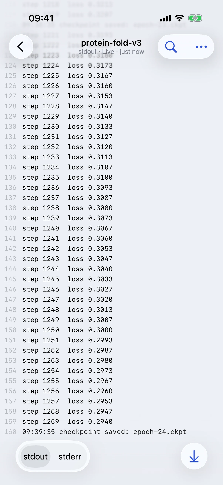
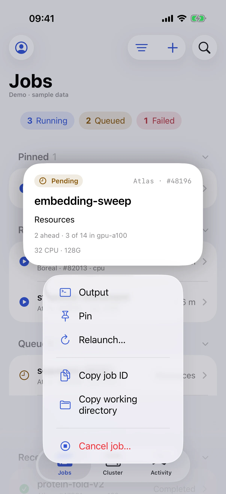
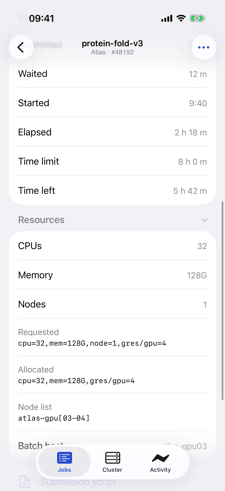
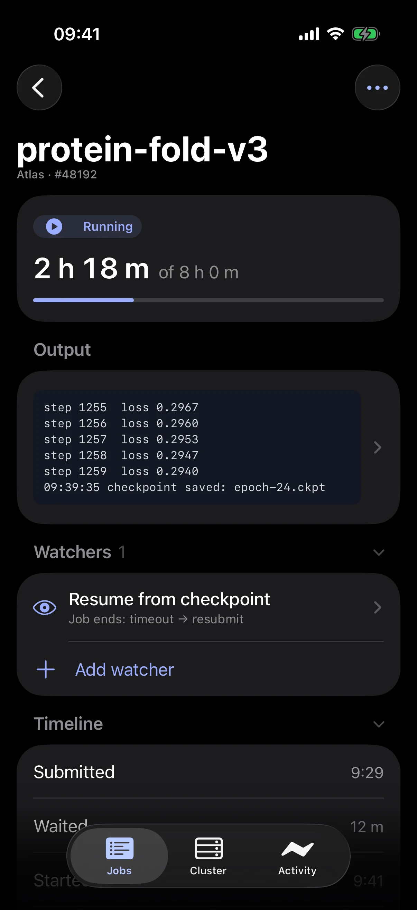
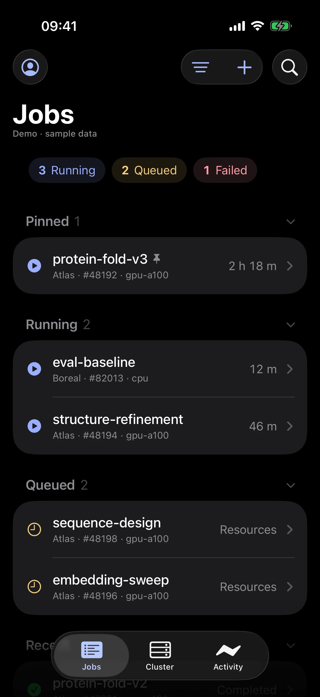
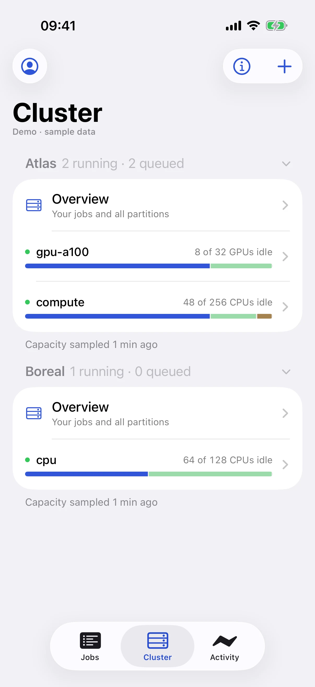
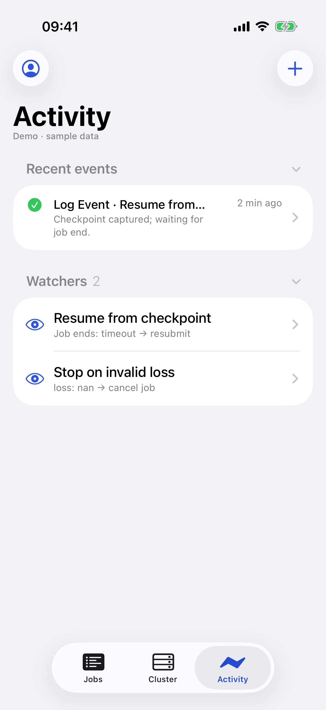
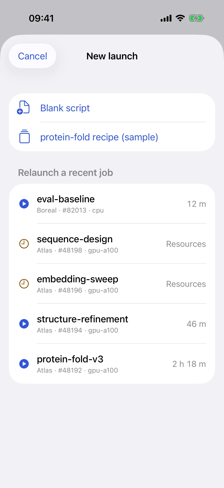
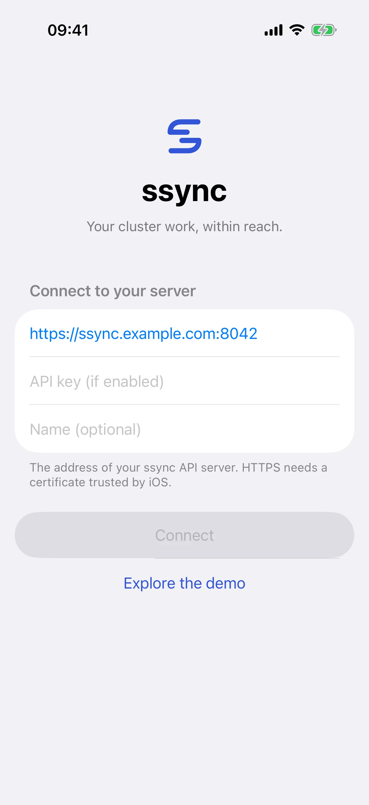

# iPhone app

A native SwiftUI app for checking on your jobs away from your desk: see what is running, read live output, check cluster capacity, and relaunch or cancel when needed.

<div class="ss-phones" markdown>



</div>

!!! info "Availability"
    The app is not on the App Store yet. Build it from source with Xcode, as described [below](#build-and-install). It requires iOS 26 or newer.

## What you can do

### Jobs

Jobs are grouped into **Pinned**, **Running**, **Queued**, and **Recent** sections. Tap a section header to collapse it; long sections show the first few jobs and a "Show all" row. Running, Queued, and Failed chips filter the list in one tap.

- **Swipe right** on a job to open its output.
- **Swipe left** to pin it, or to cancel a running or queued job (with confirmation).
- **Press and hold** for a preview card with quick actions: output, pin, relaunch, copy the job ID or working directory, and cancel.

<div class="ss-phones" markdown>


</div>

### Job details

The top of a job shows elapsed time against its limit (or its queue position), followed by the last lines of output. Below that, collapsible sections cover the timeline, queue priority, resources, usage, and scheduling details. Everything else, including following the job on the Lock Screen, lives in the **⋯** menu.

### Live output

Output fills the screen. Switch between stdout and stderr at the bottom, search with the magnifier, and scroll up to read history: a counter shows how many new lines arrived while you were away.

<div class="ss-phones" markdown>



</div>

### Cluster and Activity

**Cluster** shows each host's partitions with allocation bars, so you can see where there is room before launching. **Activity** collects in-flight launches, recent watcher events across all jobs, and your watchers, which you can pause or resume with a swipe.

<div class="ss-phones" markdown>



</div>

### Launch from your phone

Tap **+** on any tab to start a launch. Start from a recent job to relaunch it, a saved recipe, or a draft, review the request, and submit.

### Live Activities, widgets, and notifications

- **Live Activities:** follow a job on the Lock Screen and in the Dynamic Island. They update while the app is open.
- **Widgets:** a jobs summary, a pinned job, or a partition's capacity on your Home Screen. They show the data from when the app was last open.
- **Notifications:** get a push notification when jobs finish or fail. This requires Apple Push Notification service to be configured on your ssync server.

## Try it with sample data

On the connection screen, tap **Explore the demo** to use the app with sample jobs and clusters. Nothing in the demo touches a real cluster.

<div class="ss-phones" markdown>

</div>

## Connect to your server

The app talks to the same ssync server as the web app. Because `ssync web` listens only on your computer by default, your phone needs a way to reach it.

1. **Require an API key**, since the server will now be reachable by another device:

    ```bash
    ssync auth setup
    export SSYNC_REQUIRE_API_KEY=true
    ```

2. **Make the server reachable from your phone.** The safest option is a private network such as [Tailscale](https://tailscale.com/) or a VPN, with the server listening on that interface:

    ```bash
    ssync web --host 0.0.0.0 --no-browser
    ```

    Avoid exposing ssync directly to the public internet.

3. **Use a certificate your iPhone trusts.** iOS does not accept arbitrary self-signed certificates. Either install and trust the certificate authority on your phone, or put ssync behind a proxy with a trusted certificate (Tailscale can issue one for your machine's `ts.net` name).

4. In the app, enter the server URL and API key, then tap **Connect**.

See [Security](../reference/security.md) for more on API keys and exposure.

## Build and install

You need a Mac with Xcode 26 or newer.

```bash
git clone https://github.com/Ramlaoui/ssync.git
cd ssync
open ios/Ssync.xcodeproj
```

Select the **Ssync** scheme and an iPhone simulator, then press Run. To install on your own iPhone, create `ios/Configuration/Local.xcconfig` with your Apple developer team:

```text title="ios/Configuration/Local.xcconfig"
DEVELOPMENT_TEAM = YOUR_TEAM_ID
```

This file is ignored by Git. The [iOS README](https://github.com/Ramlaoui/ssync/tree/main/ios) covers App Groups, push notification entitlements, and running the tests.
