# Web app

The web app is a workspace for everything running on your clusters. Start it with:

```bash
ssync web            # starts in the background and opens https://localhost:8042
ssync web --status   # is it running?
ssync web --stop     # stop it
```

The first start builds the app, which needs Node.js 18 or newer. It serves over HTTPS with a self-signed certificate, so your browser asks you to accept it once. Use `--no-https` for plain HTTP on a trusted machine.

## Jobs

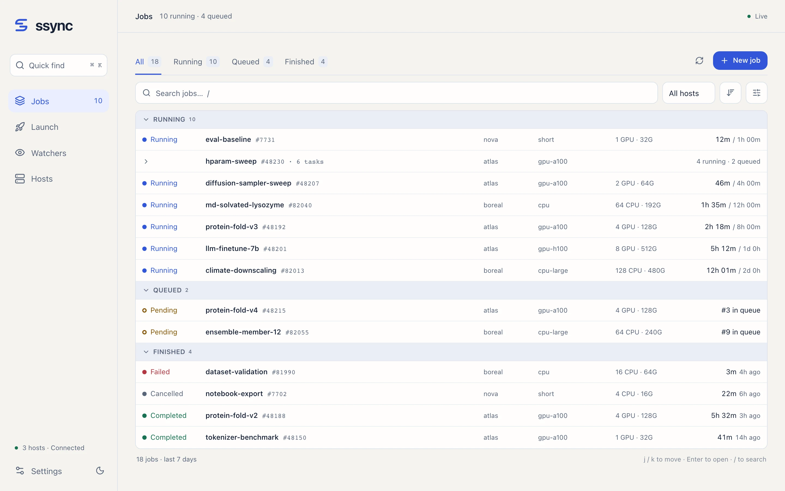{ .ss-shot }

Every job from every host lands in one table, split into **Running**, **Queued**, and **Finished** sections that you can collapse.

- **Array jobs** collapse into one row with a summary like "4 running · 2 queued". Click it to see each task.
- **Time** always means the same thing: elapsed against the limit for running jobs, queue position (or Slurm's reason) for queued jobs, and run time plus end time for finished jobs.
- **Filter** with the tabs, the search box, and the host picker. More filters (user, history window, array grouping) sit behind the sliders button.
- **Keyboard:** ++j++ / ++k++ move between rows, ++enter++ opens one, ++slash++ jumps to search, and ++cmd+k++ opens quick find from anywhere.

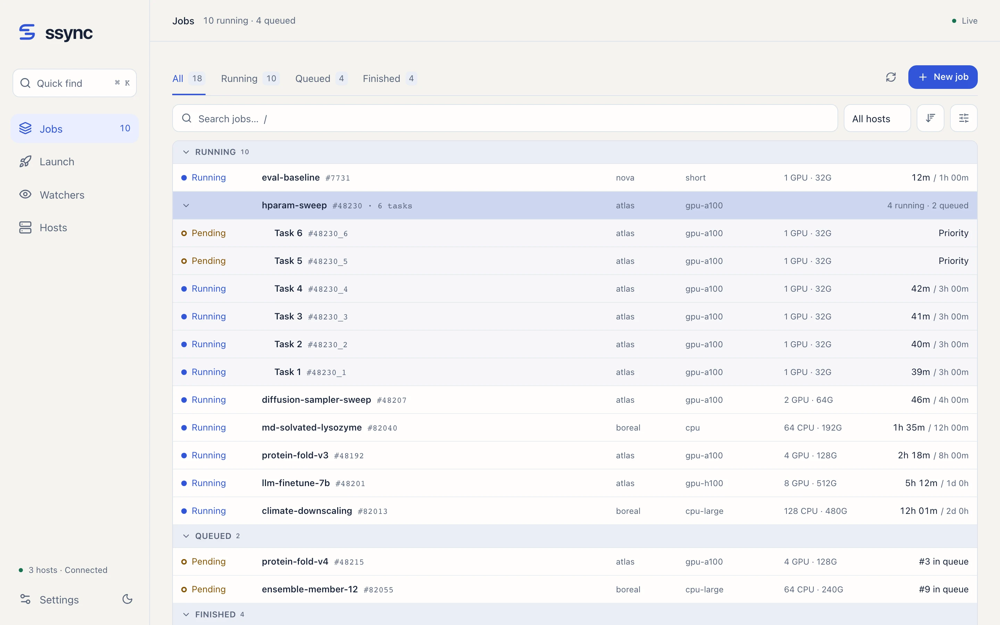{ .ss-shot }

## Job details

Click a job to inspect it beside the list. Drag the divider to resize it, or maximize the job to give it the whole window.

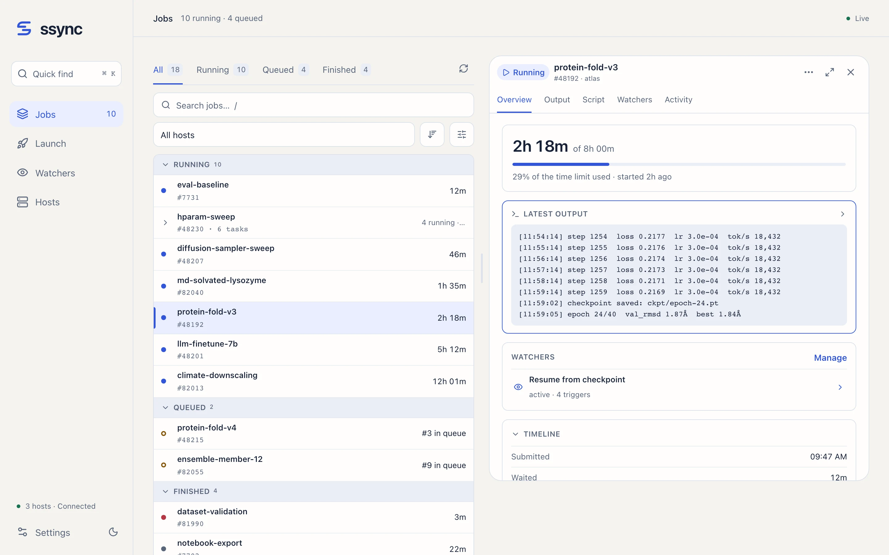{ .ss-shot }

The overview starts with what matters for the job's state:

- **Running:** elapsed time against the limit, the share of the limit used, and the latest output lines.
- **Queued:** why it is waiting, its position in the partition queue, and Slurm's expected start time.
- **Finished:** how long it ran, when it ended, and its exit code.

Below that, collapsible sections list the **timeline** (submitted, waited, started, ended, time left), **queue** details, **resources** requested and allocated, **usage** (CPU time, peak memory, disk, energy), and scheduling **details** such as account, QoS, working directory, and the submit command.

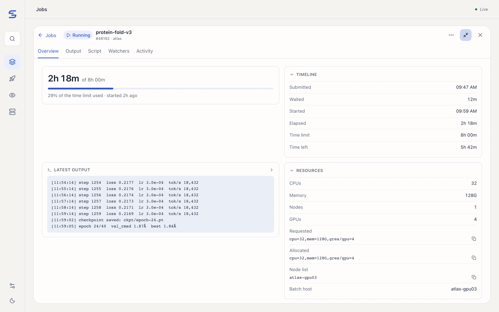{ .ss-shot }

The **⋯** menu refreshes, relaunches, attaches watchers, copies a link, or cancels the job (with confirmation).

### Queued jobs

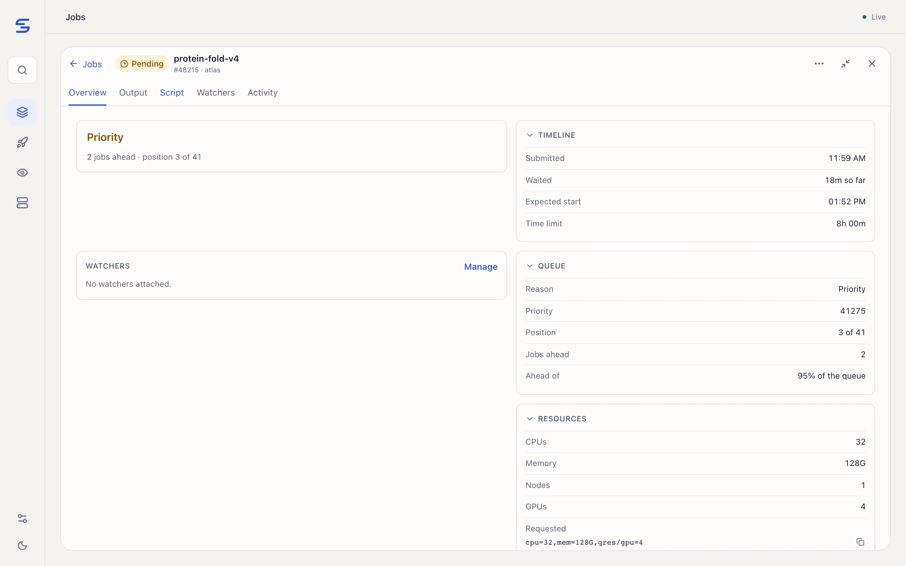{ .ss-shot }

ssync ranks pending jobs by Slurm priority within their partition, so you can see "2 jobs ahead · position 3 of 41" instead of a bare "Pending". The rank reflects priority order; reservations, dependencies, limits, and backfill can still change which job starts next.

## Output

The **Output** tab streams stdout and stderr as the job writes them. Search within the output, follow new lines as they arrive, and switch streams from the toolbar. Very large files load a bounded window first, with the rest available on demand.

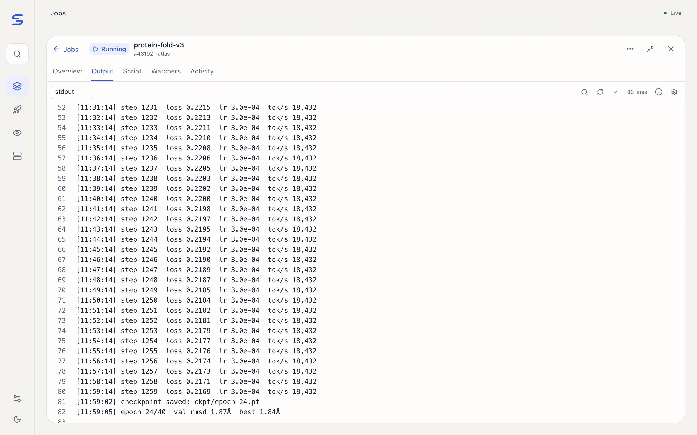{ .ss-shot }

The **Script** tab shows exactly what was submitted, including watcher blocks, and can copy or download it.

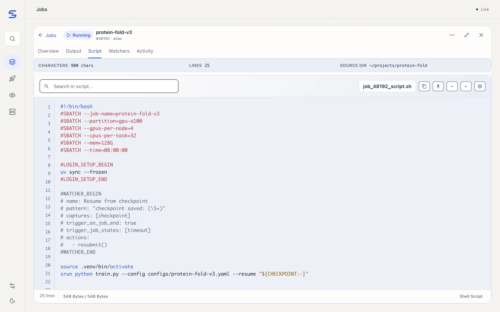{ .ss-shot }

## Watchers

The watchers page lists your automations with what they match, how often they have fired, and when they last ran. Select one to see its recent events and captured values.

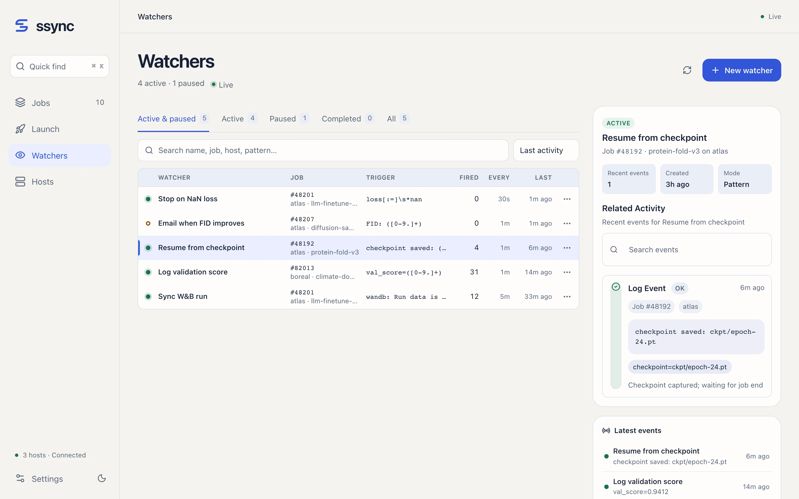{ .ss-shot }

Learn how to write them in the [Watchers guide](watchers.md).

## Hosts

Before launching, check partition capacity across your clusters: allocated and idle CPUs and GPUs, and node counts.

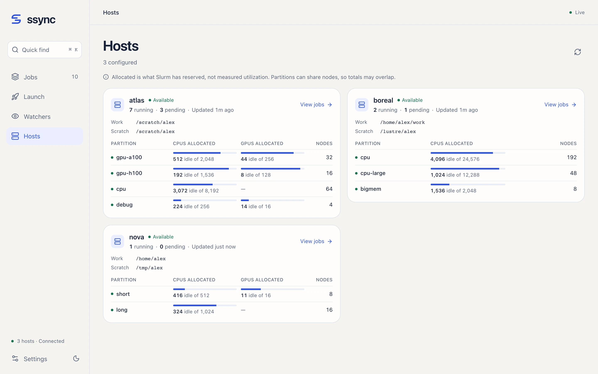{ .ss-shot }

Numbers are what Slurm has allocated, not measured utilization, and partitions can share nodes.

## Launch

Write or paste a script, choose the host and source directory, adjust resources, then **Review job** to see exactly what will be submitted before it goes out.

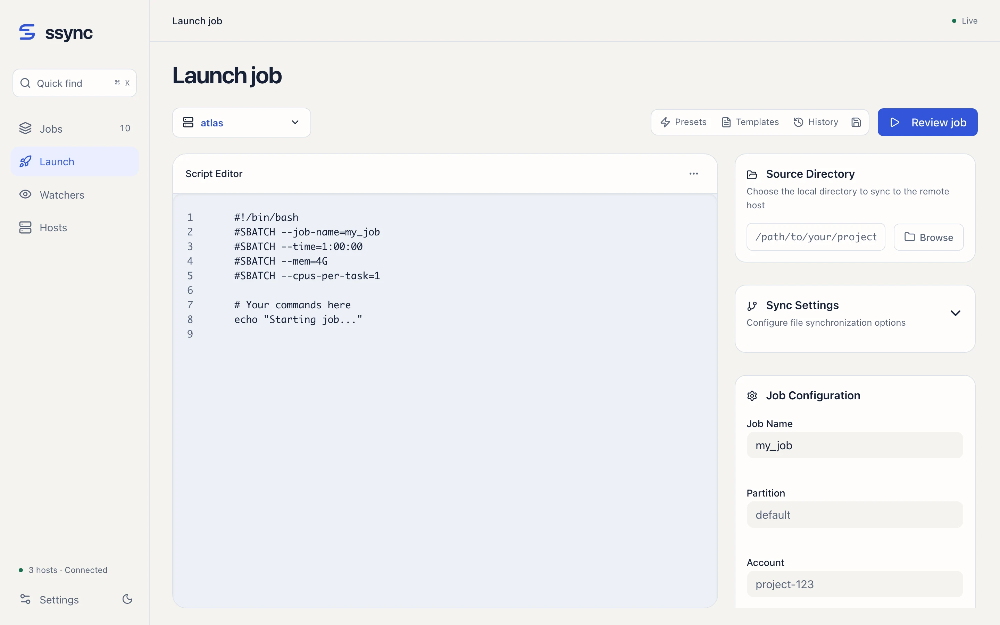{ .ss-shot }

## Quick find and dark mode

Press ++cmd+k++ to jump to any job or page. The app follows your system appearance, or you can pick light or dark in Settings.

<div class="grid" markdown>

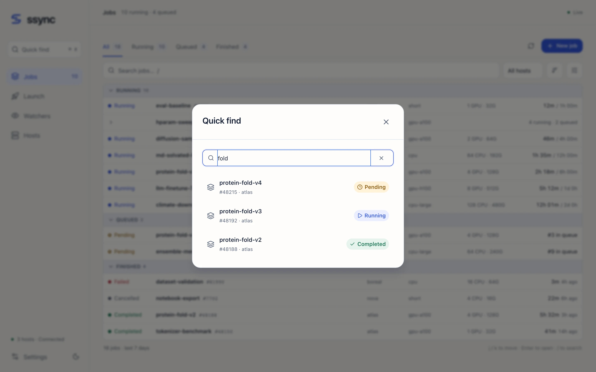{ .ss-shot }

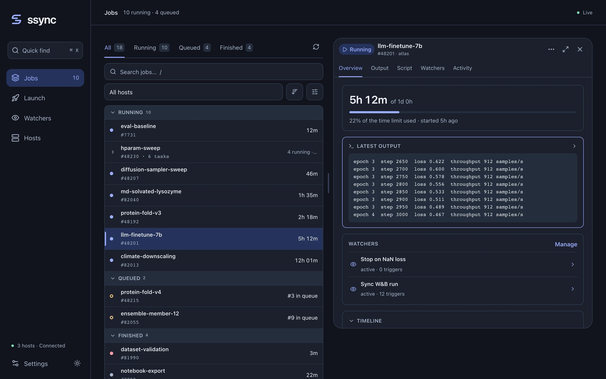{ .ss-shot }

</div>

## On a phone browser

The web app adapts to small screens, though the [iPhone app](ios-app.md) is the better mobile experience.

<div class="ss-phones" markdown>
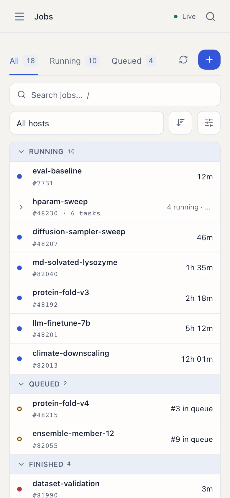
</div>
