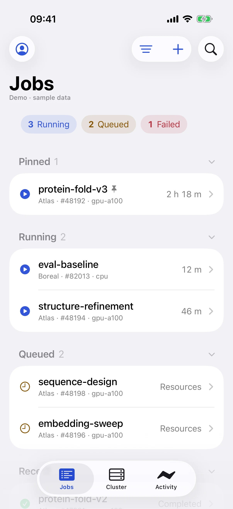
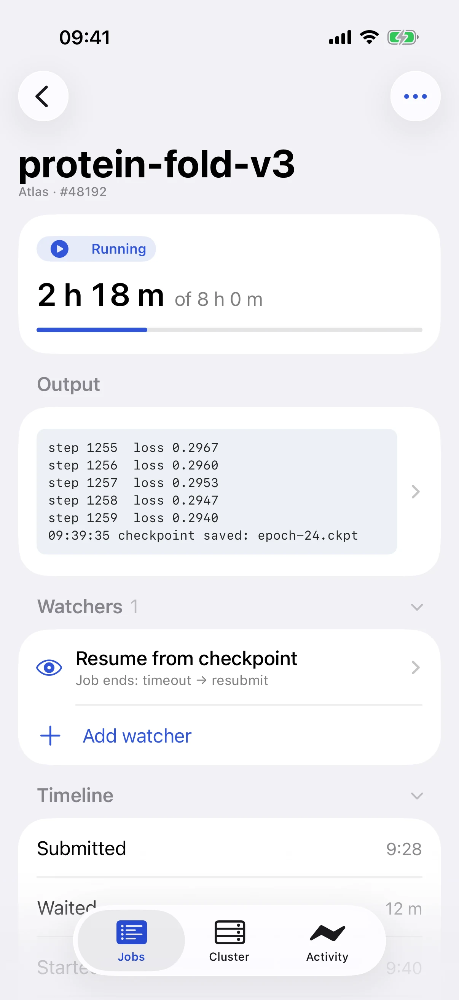
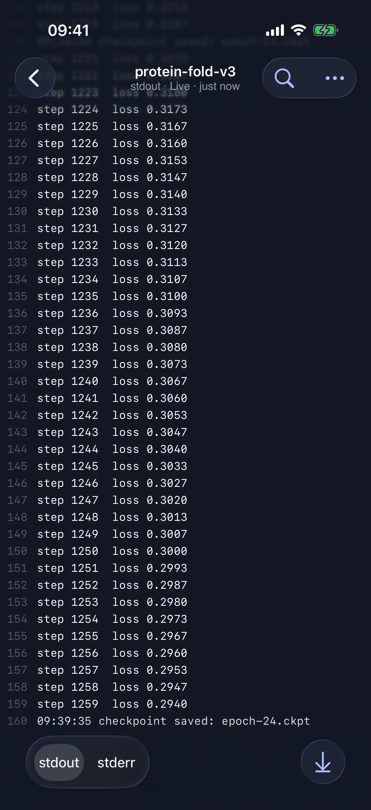

<div class="ss-hero" markdown>


# Your Slurm jobs, on every cluster, in one place

<p class="ss-tagline">ssync syncs your code, submits your jobs, streams their output, and relaunches them when they time out. It works across all your HPC clusters, from your terminal, your browser, or your iPhone.</p>

[Get started in 5 minutes](getting-started/quickstart.md){ .md-button .md-button--primary }
[Take the tour](#take-the-tour){ .md-button }
[GitHub](https://github.com/Ramlaoui/ssync){ .md-button }

</div>

<div class="ss-points">
<span>✓ Any Slurm cluster you can SSH into</span>
<span>✓ Nothing to install on the cluster</span>
<span>✓ Runs on your laptop</span>
<span>✓ Open source, Apache 2.0</span>
</div>

{ .ss-shot }

## Stop babysitting terminals

Running experiments on several clusters usually means a dozen SSH sessions: `squeue` in one, `tail -f` in another, an `rsync` you hope skipped the virtualenv, and a 3 a.m. resubmit because a job hit its time limit one checkpoint short.

ssync replaces that loop with one workspace that runs on your own machine and talks to your clusters over SSH.

<div class="grid cards" markdown>

-   :material-server-network:{ .lg .middle } __Every cluster at a glance__

    ---

    Running, queued, and finished jobs from all hosts in one dense table, with array jobs grouped into a single row and live updates as states change.

-   :material-rocket-launch-outline:{ .lg .middle } __Launch from your laptop__

    ---

    `ssync launch` syncs your project (respecting `.gitignore`), applies per-cluster defaults, and submits, all in one command.

-   :material-console-line:{ .lg .middle } __Live output, anywhere__

    ---

    Stream stdout and stderr as they are written, search them, and open the latest lines from the job page or your phone.

-   :material-robot-outline:{ .lg .middle } __Watchers that act for you__

    ---

    Match patterns in output to cancel diverging runs, capture metrics, sync W&B, or resubmit from the last checkpoint when a job times out.

-   :material-sort-numeric-ascending:{ .lg .middle } __Know where you are in the queue__

    ---

    Queued jobs show their priority rank and how many jobs are ahead of them in the partition, not just "Pending".

-   :material-cellphone:{ .lg .middle } __Your cluster in your pocket__

    ---

    A native iPhone app with Live Activities, widgets, and notifications when jobs finish or fail.

-   :material-history:{ .lg .middle } __Reproducible by default__

    ---

    Submitted scripts and launch manifests are cached locally, so you can inspect or relaunch a job after Slurm has forgotten it.

-   :material-puzzle-outline:{ .lg .middle } __Where you already work__

    ---

    A CLI for scripts, a web app for the desk, an iPhone app on the go, plus Raycast and VS Code extensions.

</div>

## Take the tour

### A workspace built for hundreds of jobs

Click any job to inspect it beside the list, with elapsed time against the limit, the latest output, attached watchers, and a timeline of when it was submitted, started, and how long it has left.

{ .ss-shot }

### Queued jobs that explain themselves

See why a job is waiting, its position in the partition queue, and when Slurm expects it to start.

{ .ss-shot }

### Automations with a clear audit trail

Every watcher shows what it matches, what it captured, and what it did.

{ .ss-shot }

### Cluster capacity before you submit

Check idle CPUs and GPUs per partition across all your hosts before choosing where to launch.

{ .ss-shot }

### And on your iPhone

<div class="ss-phones" markdown>



</div>
<p class="ss-caption">Jobs, a running job's details, and live output, in light and dark mode.</p>

## Up and running in minutes

```bash
# 1. Install from GitHub (the "ssync" package on PyPI is an unrelated project)
git clone https://github.com/Ramlaoui/ssync.git && cd ssync
uv tool install --editable .

# 2. Point ssync at a cluster from your ~/.ssh/config
mkdir -p ~/.config/ssync && cat > ~/.config/ssync/config.yaml <<'EOF'
hosts:
  - hostname: my-cluster              # an alias from ~/.ssh/config
    work_dir: /home/your-username/work
    scratch_dir: /scratch/your-username
EOF

# 3. See every job, then open the web app
ssync status
ssync web
```

[Read the quickstart](getting-started/quickstart.md){ .md-button .md-button--primary }
[Configure your clusters](getting-started/configuration.md){ .md-button }
