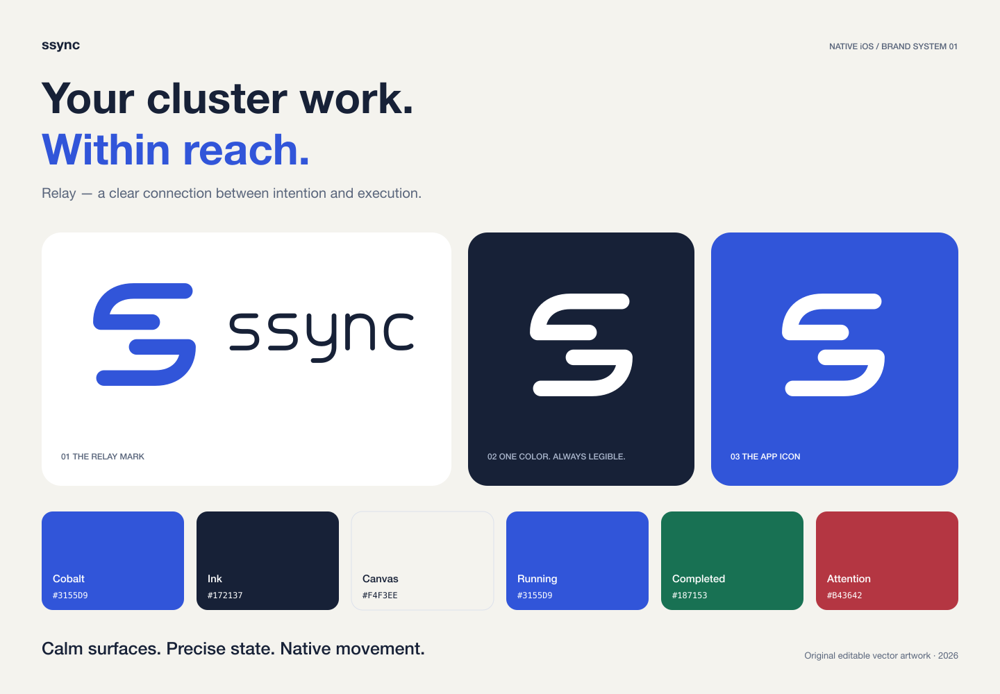
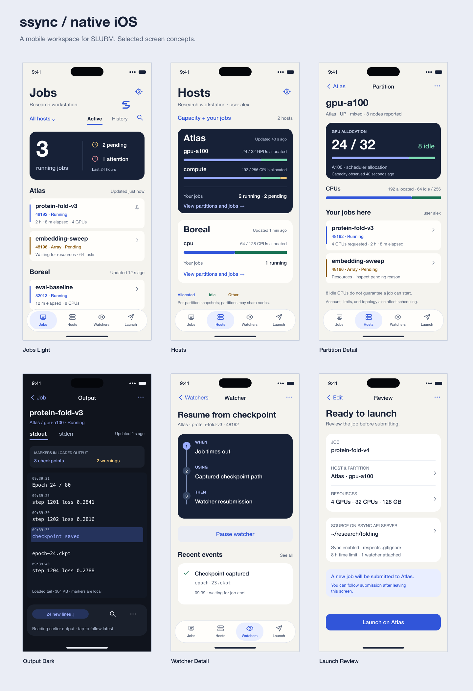
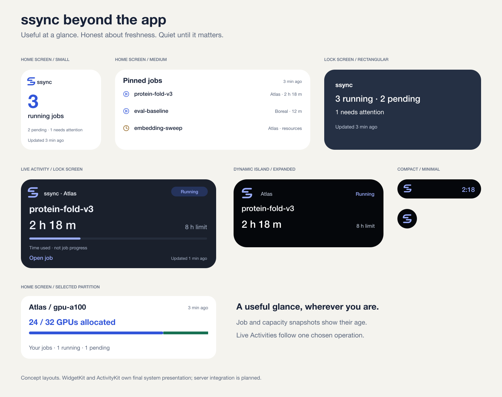
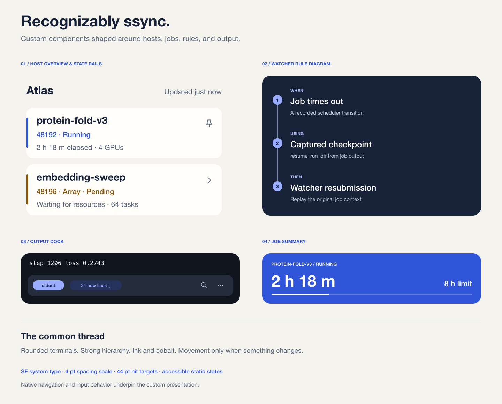
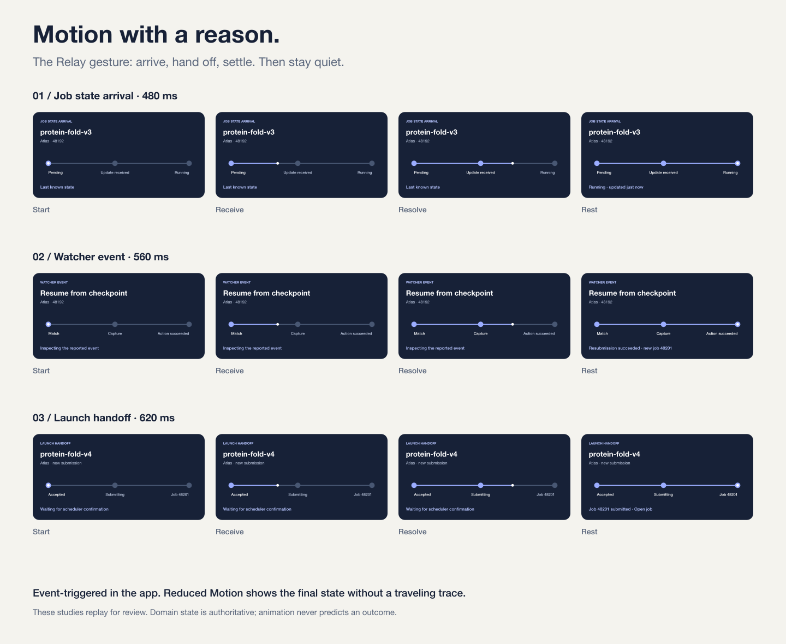

# ssync for iOS — native product, brand, and interaction specification

**Design direction:** Relay

**Prepared:** 22 September 2026

**Status:** Approved design reference. See [implementation status](IMPLEMENTATION.md) for the working native app and remaining gaps.
**Scope:** A distinctive SwiftUI iPhone and iPad app with custom ssync components and motion, native notifications, Live Activities, widgets, and a focused App Intents surface.

**Home:** This work lives entirely under [ios/](README.md).

> ssync puts your cluster work within reach. Open it to know what is happening, understand what needs attention, and take the next action with confidence.

## Contents

1. [Decisions at a glance](#1-decisions-at-a-glance)
2. [What exists and what must survive](#2-what-exists-and-what-must-survive)
3. [Product principles and task priorities](#3-product-principles-and-task-priorities)
4. [Brand identity](#4-brand-identity)
5. [Color and materials](#5-color-and-materials)
6. [Typography, spacing, shape, and density](#6-typography-spacing-shape-and-density)
7. [Icons and illustration](#7-icons-and-illustration)
8. [Information architecture](#8-information-architecture)
9. [Navigation and interaction rules](#9-navigation-and-interaction-rules)
10. [Connection and onboarding](#10-connection-and-onboarding)
11. [Jobs](#11-jobs)
12. [Job Detail](#12-job-detail)
13. [Job Output, script, and manifest](#13-job-output-script-and-manifest)
14. [Arrays](#14-arrays)
15. [Launch and manual relaunch](#15-launch-and-manual-relaunch)
16. [Watchers](#16-watchers)
17. [Hosts, partitions, and settings](#17-hosts-partitions-and-settings)
18. [Notifications](#18-notifications)
19. [Live Activities](#19-live-activities)
20. [Widgets](#20-widgets)
21. [App Intents, Spotlight, and external routes](#21-app-intents-spotlight-and-external-routes)
22. [Components](#22-components)
23. [Motion, haptics, and feedback](#23-motion-haptics-and-feedback)
24. [Accessibility and adaptation](#24-accessibility-and-adaptation)
25. [Loading, stale data, errors, and recovery](#25-loading-stale-data-errors-and-recovery)
26. [Native architecture](#26-native-architecture)
27. [Server contracts and required additions](#27-server-contracts-and-required-additions)
28. [Migration and delivery order](#28-migration-and-delivery-order)
29. [Acceptance and test plan](#29-acceptance-and-test-plan)
30. [Asset handoff](#30-asset-handoff)
31. [Decisions, risks, and explicit exclusions](#31-decisions-risks-and-explicit-exclusions)
32. [Sources and traceability](#32-sources-and-traceability)

## 1. Decisions at a glance

| Area | Decision |
| --- | --- |
| Product name | Keep lowercase **ssync**. Native display name remains ssync. |
| Brand direction | **Relay**: two opposing rounded paths that form an abstract S and suggest a handoff between local work and remote execution. |
| Brand line | “Your cluster work. Within reach.” Reserved for onboarding and presentation material. |
| Primary color | Cobalt, #3155D9. Dark appearance uses a lighter tonal counterpart, #9BADFF. |
| Character | Expressive, precise, capable, personal. Custom compositions give ssync its identity; the steady state stays calm. |
| Type | Apple system typography; monospaced digits for changing measurements and system monospace for source/output. |
| Shape | Rounded paths, short state rails, 12 pt job rows, 20 pt summary panels, connected rule diagrams; system shapes for system controls. |
| Signature components | Host overview, bold job summary, execution path, watcher rule diagram, output dock, submission handoff. |
| Signature motion | Event-driven arrival traces, numeric transitions, rule-stage handoffs, and a confirmed-launch resolution. |
| Material | Solid content surfaces. Native Liquid Glass belongs to navigation and transient controls. |
| Navigation | Four tabs: **Jobs**, **Hosts**, **Watchers**, **Launch**. Each owns its navigation history. |
| Settings | A gear in every root toolbar opens one settings sheet with its own navigation stack. |
| Job hierarchy | Host groups; running jobs first, pending jobs next; historical jobs have a deliberate view and time window. |
| Main job actions | View output, Follow live, job alerts; manual relaunch and cancellation remain explicit actions. |
| Notification transport | Native APNs, preserving the existing ssync server notification pipeline. |
| Live Activities | User-selected, short-lived tracking for a job or submission; one followed job per connection by product policy. |
| Widgets | Jobs summary, pinned jobs, and a selected partition snapshot; update age and Lock Screen variants. |
| System actions | Open a job, show jobs for a host, prepare a launch. Submitting work stays inside a review flow. |
| Baseline | iOS/iPadOS 26+. Use the shipping SDK selected at implementation time; gate APIs newer than this baseline. |
| Implementation | SwiftUI, Foundation/URLSession, Observation, SwiftData for local nonsecret records, Keychain, WidgetKit, ActivityKit, App Intents. |
| Packaging | Keep the current production bundle identifier com.ssync.mobile if signing ownership and update continuity permit it. |
| Assets | Editable original vectors, review PNGs, flat app icon variants, adaptive Xcode asset catalog, symbol inventory, generation and validation scripts. |

These decisions form one coherent direction. This document does not leave competing color palettes, several competing logos, or multiple navigation models for an implementer to choose between.

Platform behavior and ssync product choices are distinguished throughout. A feature labeled **proposed server addition** is not available merely because a screen concept depicts it.

## 2. What exists and what must survive

### 2.1 Product understanding

ssync is a local workflow surface for monitoring and operating SLURM work across configured HPC hosts. The iPhone connects to an **ssync API server**; that service communicates with hosts and owns long-running operations. The phone does not become an SSH client or a second watcher daemon.

The native app is a companion for checking, understanding, and operating that work away from a desk. It must still expose the rich workflow: scripts, scheduler metadata, output, arrays, watchers, synchronization choices, launch progress, and notifications.

The repo's [job model](../src/ssync/models/job.py) defines the domain terminology used here. In particular:

| Concept | Product wording |
| --- | --- |
| Configured HPC endpoint | Host |
| Local service accessed by clients | ssync API server |
| Tested client connection | ssync Connection |
| Address and credential | ssync API URL; ssync API Key |
| Scheduler workload | Job |
| User launches again from prior context | Manual relaunch; action label “Relaunch job” |
| Watcher launches a successor | Watcher resubmission |
| stdout/stderr | Job Output, with stdout and stderr as selectable sources |
| Completed and other terminal work | Historical jobs |
| Time range used for those jobs | Historical job window |

Marketing may describe “cluster work”; in-app selectors and identities say “Host.” Preserve raw scheduler states in detailed views without exposing unfamiliar codes as the only label.

### 2.2 Evidence from the current app and service

The Expo app already includes jobs, launch, watchers, settings, output, native push registration, app preferences, local templates, and per-job notification controls. See [App.tsx](../mobile-app/App.tsx), [API client](../mobile-app/src/api/client.ts), and [mobile types](../mobile-app/src/types/api.ts).

The service supports more than the current mobile API wrapper exposes, including complete job data, manifests, output downloads, output streaming, a launch catalog, and launch event streams. The native design should use those capabilities where their current semantics are verified.

| Capability | Evidence | Native treatment |
| --- | --- | --- |
| Multiple hosts and host defaults | /api/hosts; HostInfo | Host picker, grouped jobs, launch defaults |
| Jobs, historical windows, filters, arrays | /api/status; mobile useJobs | Preserve; simplify presentation |
| Live foreground updates | /ws/jobs | Reconcile into shared job store |
| Job metadata and resource usage | JobInfo; job routes | Summary first; full details one disclosure away |
| stdout/stderr | Output endpoint and stream/download routes | Native output viewer with bounded buffering |
| Job Script and manifest | /script and /manifest | Read, copy, share, reuse |
| Submission and stage events | /api/jobs/launch; /api/launches/{id} | Persistent submission route |
| Server-side source directory browsing | /api/local/list | Clearly identified server filesystem |
| Client-local templates | mobile ScriptTemplate | Native local template library and import plan |
| Watcher CRUD and controls | watcher routes | Readable rule summaries and full editor |
| Watcher events | /api/watchers/events | Job and watcher context; no invented global inbox |
| Notifications | notification routes; APNs and Expo providers | APNs device registration and delivery validation |
| Capacity | /api/partitions | Host capacity detail; never imply reservations |
| Connection diagnostics | info, connections, cache APIs | Advanced settings |

### 2.3 Important gaps found during inspection

1. The Expo registration code currently registers an **Expo token** even on iOS. The server also supports APNs, so the native app can retain the underlying event pipeline while changing registration and presentation.
2. Global allowed-state preferences and mute lists exist on the server. Per-job custom state lists, per-job sound, quiet hours, and device-scoped preference semantics are not represented by the current notification preference schema.
3. The mobile client constructs composite job keys, while the server notification filter compares muted entries against a bare job ID. This mismatch needs a host-aware server contract before per-job muting can be considered reliable.
4. APNs alert support is not ActivityKit integration. The APNs client's current topic is the app bundle ID; Live Activities need their own topic, token lifecycle, state payload, and update orchestration.
5. A launch catalog exists, but discovery of recipes is not a verified recipe-render-and-submit API. Native recipe launch must not be advertised until that contract exists.
6. The current watcher event route can filter by job ID or watcher ID, but lacks a host query. Native job-scoped events must filter returned records by hostname and eventually request host-aware server filtering.
7. The launch endpoint creates a new launch identifier per accepted request. An app retry after an ambiguous network timeout must not blindly submit another job. Idempotency is a proposed addition.
8. Existing Expo storage is not automatically readable through SwiftData. A deliberate migration bridge or export/import path is needed.

These are implementation requirements, not reasons to remove useful features from the design.

## 3. Product principles and task priorities

### 3.1 Priorities by frequency

| Priority | User intent | Target interaction |
| --- | --- | --- |
| Daily, seconds | “Is my job still running?” | Open app or widget; read state and freshness immediately |
| Daily, seconds | “What failed?” | Tap attention summary or notification; open precise job |
| Frequent, short | “Show me the latest output.” | One tap from Job Detail |
| Frequent, short | “Tell me when it finishes.” | Job alerts within two actions from Job Detail |
| Occasional, deliberate | “Run that again with a small change.” | Manual relaunch opens a prefilled draft and review |
| Occasional, deliberate | “Stop this job.” | Visible action with exact job/host confirmation |
| Occasional, detailed | “What will this watcher do?” | A When / Using / Then explanation before raw configuration |
| Occasional, detailed | “Submit work away from my desk.” | Template or prior job, focused editing, review, durable launch progress |
| Setup | “Connect this phone.” | Test connection before saving; explain server reachability |

### 3.2 Design rules

- Put **state, identity, and freshness** together. “Running” without a timestamp can be misleading.
- Prefer a compact set of well-organized rows over many competing dashboard panels.
- Give frequently used actions a visible home; gestures are optional accelerators.
- Keep source material accessible. Simplifying a summary must not erase the script, manifest, scheduler data, or watcher conditions.
- Save local drafts as users work. Connection failures should not discard editing.
- Treat a pending job as a legitimate long-lived state. Do not show an endless spinner as its identity.
- Separate **elapsed allocation time**, **time limit**, **array completion**, and **application progress**. These are different measurements.
- Keep the phone responsive while the API server or a host is slow.
- Preserve working push delivery as a release gate throughout migration.
- Use native navigation, selection, forms, menus, sheets, sharing, and accessibility behavior.

### 3.3 Measures of success

These are usability targets to validate with real users, not claims about an implemented app:

- A connected user can identify a selected job's state and host in five seconds.
- Opening output from the jobs list takes two taps.
- A notification tap opens the correct job on the correct host, including a cold start.
- Users can recover a draft after navigating away or terminating the app.
- A list refresh does not lose the user's scroll anchor or move a row while it is being pressed.
- A stale or unavailable host cannot silently appear fully current.
- Essential flows remain usable at accessibility text sizes without horizontal scrolling.
- A user can explain a watcher's trigger and consequence from its summary without reading JSON.
- No network retry produces an unintended duplicate launch.

## 4. Brand identity

### 4.1 Name and voice

Keep **ssync**. Existing users already know the name and the product spans several clients.

Use the brand line only where it contributes meaning: onboarding, the README cover, and release/design material. After onboarding, the product should use operational information rather than repeat promotional copy.

Voice is concise, specific, and calm:

| Context | Preferred copy |
| --- | --- |
| Connection succeeds | “Connected to Research workstation.” |
| Host temporarily unreachable | “Atlas is unavailable. Showing jobs updated 12 min ago.” |
| Submission accepted | “Submission started. You can leave this screen.” |
| Scheduler confirms submission | “Job 48192 submitted to Atlas.” |
| Permission declined | “Alerts are off on this iPhone. You can enable them in Settings.” |
| Cancel confirmation | “Cancel protein-fold-v3 on Atlas?” |
| Ambiguous launch result | “Submission status is unknown. Check recent jobs before trying again.” |
| Empty active list | “No running or pending jobs.” |
| No output yet | “Output will appear after the job writes to stdout.” |

Do not anthropomorphize hosts or use celebratory animations for ordinary compute work. Completion feedback can be satisfying without becoming distracting.

### 4.2 The Relay mark

The mark consists of two opposing paths with rounded terminals. Together they form an abstract S. The central interruption suggests a handoff while preserving two independently readable paths.

It is designed to work in one color and at small sizes. No gradient, glow, network diagram, cloud, terminal prompt, or detailed server illustration is required for recognition.

The geometry is defined in [the asset generator](scripts/generate_design_assets.py):

- Master viewBox: 100 × 100.
- Stroke width: 10 units.
- Upper path starts at x=76, y=22 and folds toward a middle terminal.
- Lower path is its 180-degree counterpart.
- Central clear gap between horizontal strokes: 6 units.
- Round line caps and joins.
- The exported viewBox includes breathing room.
- Minimum recommended standalone display size: 24 pt; use the single mark at 20 pt only after device review.
- Clear space outside the visible mark: at least one stroke width.
- Never stretch, rotate, rearrange, or place text inside the mark.

Use the cobalt mark on light surfaces, the white mark on dark brand fields, and an adaptive single-color mark in system surfaces. When a product state is nearby, the logo must not masquerade as the state symbol.

### 4.3 Wordmark and lockup

The wordmark is original outlined vector lettering with rounded strokes. Its proportions echo the Relay mark without requiring a redistributed font.

Use the horizontal lockup in onboarding, connection screens, documentation covers, and release material. Do not place a large lockup at the top of every operational screen.

The app name in a navigation title or notification is ordinary system text, lowercase ssync. The outlined wordmark is a brand asset, not a substitute for accessible text.

Provided variants:

- [Cobalt mark](assets/brand/relay-mark-cobalt.svg), [ink mark](assets/brand/relay-mark-ink.svg), [white mark](assets/brand/relay-mark-white.svg).
- [Ink wordmark](assets/brand/wordmark-ink.svg), plus cobalt and white variants.
- [Ink lockup](assets/brand/lockup-ink.svg), plus cobalt and white variants.

### 4.4 App icon

The default app icon is a white Relay mark on cobalt. It has an opaque, full square canvas; iOS applies the platform mask.

The dark variant uses ink with a pale cobalt mark. The tinted variant uses grayscale artwork so it can participate in system tinting.

The mark occupies a consistent central region across all appearances. Never bake the outer rounded rectangle, drop shadow, specular shine, or device wallpaper into the icon export.

The supplied 1024 × 1024 PNGs are flat, opaque app-icon assets. Separate SVG [background](assets/app-icon/layers/background.svg) and [foreground](assets/app-icon/layers/foreground.svg) layers are provided for Icon Composer. Import and tune them there before claiming a production layered icon. The repository does not yet contain a compiled .icon document.

Apple supports importing SVG or PNG layers into Icon Composer and using the resulting icon in Xcode; the platform generates appearances from that structure. This handoff deliberately separates source artwork from that platform composition step. [Apple: Creating an app icon with Icon Composer](https://developer.apple.com/documentation/xcode/creating-your-app-icon-using-icon-composer)

### 4.5 Brand assets versus product illustrations

Empty-state illustrations are quiet line drawings with a small cobalt area. They explain absence or connection, never decorate normal data screens.

Provided illustrations: no jobs, no watchers, and a connection between an API server and a phone. Onboarding should use the mark and direct copy rather than a slideshow.

## 5. Color and materials

### 5.1 Semantic palette

The machine-readable source of truth is [tokens.json](design/tokens.json). Color names are semantic and match the generated Xcode color assets.

| Token | Light | Dark | Use |
| --- | --- | --- | --- |
| Canvas | #F4F3EE | #10141D | Warm paper / deep ink background |
| Surface | #FFFEFB | #1A202C | Content groups and elevated information |
| SurfaceSecondary | #EAEDF5 | #252D3C | Insets, neutral controls, secondary grouping |
| Ink | #172137 | #F2F5FC | Primary content |
| InkSecondary | #59657B | #AAB6CC | Metadata, timestamps, secondary copy |
| Separator | #DCE1EB | #354055 | Nonessential grouping lines |
| Accent | #3155D9 | #9BADFF | Interactive emphasis |
| AccentSoft | #E9EEFF | #25335C | Selection and informational emphasis |
| OnAccent | #FFFFFF | #101C45 | Text on filled accent buttons |
| Running | #3155D9 | #9BADFF | Executing jobs |
| Success | #187153 | #7EDDB5 | Completed jobs, verified success |
| SuccessSoft | #E6F4ED | #183A31 | Success containers |
| Warning | #865408 | #F3CB7A | Pending, time-limit caution, stale data |
| WarningSoft | #FFF2D9 | #3E301C | Warning containers |
| Danger | #B43642 | #FF9EA6 | Failed jobs and destructive actions |
| DangerSoft | #FCEBED | #45262F | Error containers |
| CodeCanvas | #EDF0F6 | #121824 | Output, source, and manifest reading |

Use AccentSoft with Accent text. Use WarningSoft with Warning text. Never place white text on the dark appearance's pale Accent; use OnAccent.

Disabled controls use native disabled treatment and remain discernible. Do not make meaning depend on the low-contrast Separator token; it is not a text or essential icon color.

### 5.2 State language

| State | Text | Symbol | Treatment |
| --- | --- | --- | --- |
| Running | Running | play.circle.fill | Cobalt |
| Pending | Pending | clock | Amber-brown |
| Completed | Completed | checkmark.circle.fill | Green |
| Failed | Failed | exclamationmark.circle.fill | Red |
| Cancelled | Cancelled | xmark.circle | Secondary ink |
| Timed out | Timed out | hourglass | Warning; attention summary includes it |
| Unrecognized or missing | Unknown | questionmark.circle | Secondary ink, preserve raw state in detail |

Normalize documented SLURM codes and full names in one domain mapping. Handle additional scheduler states as explicit known mappings or an unknown-state presentation, rather than silently calling all non-running work “completed.”

Color is redundant information. Labels, distinct symbols, and accessibility values remain present in monochrome and increased-contrast modes.

### 5.3 Native material policy

Use native TabView, toolbar, sheet, menu, and navigation behavior. Build the main content with custom ssync compositions, stronger contrast, distinctive rows, connected rule stages, and event-triggered motion. The preview boards approximate placement and hierarchy; their painted tab bars are not instructions to build a custom tab bar.

Liquid Glass belongs to the control/navigation layer. Job rows, output blocks, resource summaries, watcher rules, and error explanations remain solid, readable content surfaces. Avoid stacking custom glass on top of native glass or placing it behind a dense terminal-like output area. [Apple: Materials](https://developer.apple.com/design/human-interface-guidelines/materials)

If a custom floating control is needed, use the regular glass variant and native glass APIs. Group adjacent custom glass elements appropriately. Honor Reduce Transparency and Increased Contrast. With the chosen iOS 26 baseline, older-platform fallback UI is unnecessary; any future lower deployment target must include an availability branch and a solid or standard-material fallback.

### 5.4 Contrast policy

Target at least 4.5:1 for standard text and 3:1 for essential nontext indicators. Keep these targets even for small metadata. The asset validator calculates solid-color token pair ratios and writes a report.

Those calculations do not certify native glass, wallpaper-dependent widgets, actual font rendering, or system controls. Validate those on-device with real content and accessibility settings.

## 6. Typography, spacing, shape, and density

### 6.1 Typography

Use SwiftUI semantic text styles so Dynamic Type works naturally. Reference sizes describe the default design, not fixed constraints.

| Role | Style | Default reference | Weight / details |
| --- | --- | --- | --- |
| Root title | largeTitle | 34 pt | Bold |
| Job detail title | title or title2 | 28/22 pt | Semibold; wraps |
| Section heading | title3 | 20 pt | Semibold |
| Job row title | headline | 17 pt | Semibold |
| Body and form value | body | 17 pt | Regular |
| Supporting copy | subheadline | 15 pt | Regular |
| Metadata | footnote | 13 pt | Regular |
| Statistics | title | 28 pt | Semibold, monospaced digits |
| Output/script | callout, monospaced | 16 pt | Selectable, adjustable |
| Tab labels | System-owned | System-owned | Never manually shrink |

Use monospaced digits for counters and elapsed values. Use full monospaced text only for job IDs, source snippets, paths where useful, and output. The whole app must not look like a terminal.

Two-line job names are allowed at ordinary sizes; larger accessibility sizes wrap further. Prefer truncating a secondary path with an explicit full-path view over truncating job identity.

### 6.2 Spacing

Use the 4 / 8 / 12 / 16 / 20 / 24 / 32 / 40 pt scale.

- Phone horizontal content margin: 20 pt.
- Card inner margin: 16 pt; larger informational panels may use 20.
- Between tightly related labels: 4–8 pt.
- Between rows or controls: 8–12 pt.
- Between groups: 24–32 pt.
- Before major sections: approximately 32–40 pt.
- Base job row minimum height: 88 pt.
- Primary button minimum height: 50 pt.
- Minimum target for all app-owned interactive elements: 44 × 44 pt.
- Native bars and sheets use their system spacing and safe areas.

A 20 pt icon can sit inside a 44 pt target. A 28 pt visual pill must still have a 44 pt hit region with enough separation from neighboring targets. This follows Apple's general button hit-region guidance. [Apple: Buttons](https://developer.apple.com/design/human-interface-guidelines/buttons)

### 6.3 Shape and elevation

Use continuous corners for app-owned rounded rectangles:

- Small inset: 10 pt.
- App-owned control: 12 pt.
- Job row: 12 pt with a short leading state rail.
- Standard group/card: 20 pt.
- Hero or summary surface: 24 pt.
- Pills: capsules, only for short states or filter values.
- Sheets, system buttons, tab bars: system shape.

Most content uses grouping and whitespace rather than shadows. Avoid outlining every row. Separate rows in one group with an inset separator; use independent cards only when each is a coherent object.

### 6.4 Density

Default density favors fast reading. A compact option can remove tertiary row metadata but must preserve name, state, host context, and job ID. It does not reduce hit targets or ignore text-size preferences.

Do not use a permanent grid of six tiny metric tiles on a phone. Two or three meaningful measurements can be grouped; the remaining scheduler fields live in a detail list.

## 7. Icons and illustration

### 7.1 System iconography

Use SF Symbols directly at runtime. The full [symbol inventory](design/symbols.json) lists role, symbol name, selected variant where relevant, and spoken label.

Selected tabs use the appropriate filled variant. Use regular or medium visual weight within content; use semibold only when it supports selected state or a prominent action.

The main mappings are:

| Role | Symbol |
| --- | --- |
| Jobs | square.stack.3d.up |
| Watchers | eye |
| Launch | paperplane |
| Settings | gearshape |
| Host | server.rack |
| Output | text.alignleft |
| Script | doc.text |
| Manifest | list.bullet.rectangle |
| Resources | cpu |
| Job alerts | bell |
| Follow live | waveform.path |
| Manual relaunch | arrow.clockwise |
| Cancel job | stop.circle |
| Source directory | folder |

Use visible labels for uncommon actions. An unlabeled eye, waveform, or circular arrow is insufficient for a first-time user to understand the effect.

The screen SVGs use schematic line glyphs to remain self-contained; implementation must use the listed SF Symbols. They are composition studies, not a pixel-exact rendering of the OS.

### 7.2 Custom domain glyphs

Three original 24 × 24 SVGs and vector-preserving template PDF image assets are supplied:

- **Job array:** a small repeated-cell motif for array explanations.
- **Watcher rule:** inputs converging on an action point.
- **Launch recipe:** a structured document.

Use these sparingly in explanatory content and template rows. Do not replace the entire native icon vocabulary with a custom set. Render as template images with semantic foreground colors.

No downloadable icon pack, licensed bitmap stock, or third-party font is required.

## 8. Information architecture

### 8.1 The four tabs

**Jobs** is the default landing destination. It answers what is running, what is waiting, and what happened to historical work.

**Hosts** is the capacity and cluster-situation workspace. It compares host reachability, partition availability and allocation, and jobs within a selected user scope. Host and partition views link directly to relevant jobs and output. This is a first-class destination because cluster context is a frequent mobile need.

**Watchers** is the durable rules workspace. It contains active/paused/completed rules and their event histories. It remains a top-level destination because automation can span many jobs.

**Launch** is a useful library, not an empty form. It opens with drafts, templates, recent jobs available for relaunch, and recipe catalog entries when supported. “New job” starts a deliberate editor.

Settings, connection management, notification preferences, and diagnostics are not full-time tabs. They are available from each root toolbar. A user should not have to leave the current job to understand its related watchers.

### 8.2 Destination tree

~~~
App
├── Connection / Demo, when no tested connection exists
└── Native tabs
    ├── Jobs
    │   ├── Host scope / job filters
    │   ├── Historical jobs
    │   ├── Job Detail
    │   │   ├── Output → search / share
    │   │   ├── Resources and scheduler details
    │   │   ├── Script / manifest
    │   │   ├── Related watcher → events
    │   │   └── Alerts / Follow live / action menu
    │   ├── Array → task Job Detail
    │   └── Host → partitions and connection status
    ├── Hosts
    │   ├── Host overview → partitions
    │   ├── Partition → capacity / pending reasons / scoped jobs
    │   └── Job Detail → output
    ├── Watchers
    │   ├── Watcher Detail → events → event detail
    │   └── New / edit watcher
    └── Launch
        ├── Drafts
        ├── Templates / template detail
        ├── Recent jobs → prefilled draft
        ├── Recipe catalog, capability gated
        └── Editor → review → submission progress → Job Detail

Shared settings sheet
├── ssync Connection
├── Notifications
├── Widgets & Live Activities
├── Appearance / history / display
└── Advanced / import / diagnostics
~~~

### 8.3 Scope and identity

One ssync Connection may expose multiple hosts. Host selection is not connection selection.

The architecture must support multiple connection records, but v1 operates on one selected connection at a time. Connection switching belongs in Settings. Every job, watcher route, pin, draft, and cached record includes the connection identity.

Job identity is a composite of connection ID, hostname, and job ID. A SLURM job ID by itself is not globally unique.

Arrays have an explicit parent identity and task identities. Watchers retain their server identifier plus connection context. Do not infer these relationships from display names.

## 9. Navigation and interaction rules

### 9.1 Native navigation

Each tab owns a NavigationStack and its own typed path. Switching tabs preserves position and state. Return to Jobs restores the previous host scope, search, filters, and scroll anchor.

Push destinations for reading or exploring. Use sheets for scoped choices and editors. Use confirmation dialogs for consequential actions.

Job Detail is a push. Output is a push with the native tab bar hidden to give content room. Returning from output lands at the same detail position.

Settings opens a large sheet from the root toolbar. It contains an internal navigation stack and a Done button. A settings change does not reset the underlying tab.

The launch editor is a sheet with a navigation stack; allow a large detent only for full editing. Keep the persistent draft even if the sheet is dismissed. The review step lives inside this editor flow.

### 9.2 Thumb reach

The root tab bar is the primary lower-screen navigation. In Job Detail, View output and Follow live appear together directly under the state summary. The native toolbar menu remains the home for less frequent operations.

Long editing flows have a bottom safe-area action such as Review or Launch on Atlas. This control moves with the keyboard or yields to the keyboard's native accessory, never floating over editable fields.

A destructive action must not share the primary button's position without an explicit intervening review or confirmation.

### 9.3 Gestures

- Native edge swipe to go back.
- Pull to refresh with an inline freshness update.
- Job leading swipe: pin/unpin.
- Job trailing swipe: job alert settings; optionally More.
- No immediate destructive full-swipe cancellation.
- Long press: contextual shortcuts that duplicate visible menu actions.
- Output vertical scrolling pauses auto-follow.
- Horizontal swipes are not required to navigate core screens.
- No custom full-screen pan gesture that competes with native back navigation.

### 9.4 Deep links

An external route validates connection and identity, selects the owning tab, and opens the destination once. Foreground and cold-start paths share the same route resolver.

If a launch editor contains unsaved changes, persist it before handling a notification. Present the incoming destination after a clear transition; do not stack duplicate sheets.

If the app cannot resolve the job, show the requested host and job ID with Retry and a route to that host's jobs. A deleted or inaccessible record is not a blank screen.

### 9.5 Preserve context during updates

Reconcile records by stable composite identity. Keep row order stable while a user is interacting. New items can be inserted when the list is at the top; otherwise show a small “New updates” affordance and apply the updated order when requested.

State changes can update text and symbols in place. Avoid a full-list reload animation for each socket event.

Search text, filtering, and selection survive a refresh. An interrupted network request must not clear the last successful data.

## 10. Connection and onboarding

### 10.1 First launch

One focused connection screen explains the relationship:

“Connect to your ssync API server to see jobs across your hosts.”

Fields:

- Connection name, optional; derive a sensible hostname-based display name initially.
- ssync API URL.
- ssync API Key, optional when the server permits it.
- Test connection.

Offer **Explore demo** as a secondary local-only path with deterministic fixtures and a persistent Demo label. Demo mode never submits jobs or registers a notification token.

Do not request notification permission on the first screen. Ask after a successful connection when the benefit can be explained.

### 10.2 Connection testing

Normalize trailing slashes and validate the URL locally. Allow server subpaths if the API client consistently supports them. Preserve the user-entered URL while showing a normalized preview.

Test authentication and host discovery. Surface results separately:

- Reachable and authenticated.
- Reachable but API Key rejected.
- Invalid or untrusted TLS certificate.
- Network unavailable.
- No hosts configured.
- Server answered, but its API is incompatible.

A reachable server with no hosts is a valid connection plus an actionable empty state; it is not a generic connection failure.

Store credentials in Keychain after a successful test. Do not include the API Key in app logs, route URLs, clipboard exports, analytics, or widget snapshots.

### 10.3 Reachability and TLS

The server must be reachable from the iPhone, for example through an existing private network or a trusted HTTPS endpoint. Explain that localhost on the phone is the phone itself.

The current ssync server can use self-signed certificates. Native URLSession should not disable certificate verification globally. Document a trusted-certificate/private-network setup; if certificate pinning is added, make enrollment explicit and preserve hostname checks.

A development-only HTTP option must be narrowly configured and clearly separated from release defaults. Do not silently weaken all app transport security.

These are practical connection requirements, not a multi-page security onboarding flow.

### 10.4 After connection

Show discovered hosts, then enter Jobs. When the user chooses Enable alerts, explain:

“Get an alert when your jobs finish or need attention.”

Then show the system permission request. If permission is declined, return to a usable app with a concise settings state; do not repeatedly ask.

## 11. Jobs

### 11.1 Root anatomy

At default text size:

1. Large Jobs title and settings control.
2. Host scope plus Active / History selection.
3. Search.
4. Small summary of running, pending, and attention counts.
5. Host-grouped rows.
6. Native tab bar.

The root subtitle identifies the selected connection. The Relay mark can appear as a small signature near this context, without competing with state symbols.

The ink summary panel uses one large running count and a quieter pending/attention column. Tapping a count applies the corresponding filter and makes the active filter obvious. Number changes use a short, bounded transition; the panel keeps a stable size.

**Attention** means failed or timed-out jobs in the current historical window that have not been acknowledged on this device. It is separate from the Active list. Opening the attention count selects the relevant historical filter. Server-backed cross-device acknowledgement is not part of v1.

### 11.2 Rows

A job row shows:

- State symbol.
- Job name.
- Job ID and explicit state label.
- One tertiary line: elapsed time and resources for running jobs, reason for pending jobs, end time or exit result for historical jobs.
- Pin indicator, when pinned.

The host is supplied by the section heading. When search results flatten or cross-host context is otherwise absent, include the host in each row.

Unknown values appear as “Unavailable” or are omitted according to context. Missing memory is not 0 GB. A pending reason should remain readable even when it is longer than one line.

No progress circle based on time limit appears in the root list. It would invite users to read time consumed as work complete.

### 11.3 Ordering and counts

Within each host, show pinned jobs first as a distinct, small group, then running jobs and pending jobs. Preserve stable secondary order, initially descending submission time. Historical mode sorts by relevant end/change time descending.

Array parents count as one grouped row. Show task counts separately. Summary copy must state “jobs” or “tasks” consistently; never silently add grouped parents and their children into the same total.

When results are server-limited, show “Showing N” rather than claiming a complete global count. If the server cannot provide a total, do not invent pagination totals.

### 11.4 Filters and search

The filter sheet includes host, state, user, historical window, array grouping, and optionally partition when supported by available data.

Use explicit Apply and Reset in a complex filter sheet. For the simple host menu, selection applies immediately.

Search supports name, job ID, and user through the verified API contract. Debounce remote queries, cancel superseded requests, and keep current results visible while searching.

Display active constraints as a concise summary. Empty filtered results offer Clear filters. Empty unfiltered results explain the real absence.

### 11.5 Refresh and host failures

Foreground socket updates improve freshness but do not prove every host is reachable. Display host-scoped last-successful timestamps.

If Atlas is unreachable but Boreal is healthy, preserve both groups. Atlas shows saved records with a stale indication; Boreal continues to update.

Pull to refresh requests a refresh according to the service's existing refresh semantics. A queued refresh is not a completed refresh; keep the timestamp until fresh data actually arrives.

## 12. Job Detail

### 12.1 Hierarchy

The first screen answers:

- What job and host is this?
- What state is it in?
- How fresh is that answer?
- How long has it been running or waiting?
- Where is the output?
- What can I do next?

Below the fold, progressively expose:

- Resources and scheduler details.
- Related watchers and recent watcher events.
- Job Script and launch manifest.
- Working directory and output paths.
- Submission and timing metadata.
- Job actions.

### 12.2 State-specific summary

| State | Summary | Primary action |
| --- | --- | --- |
| Running | Elapsed time, time limit, start time | View output |
| Pending | Pending reason, submission time, wait duration | View details / job alerts |
| Completed | Completion time, runtime, exit code if known | View output |
| Failed | Failure state and available exit code | View stderr |
| Timed out | Time limit reached; runtime | View output; manual relaunch in actions |
| Cancelled | Cancellation state and available end time | View output |
| Unknown | Raw state if present, latest observation | Refresh / view available details |

Only show a specific failure cause if the API provides evidence. A nonzero exit code is not enough to infer out-of-memory or a Python exception.

### 12.3 Time visualization

An optional horizontal bar shows elapsed time divided by the scheduler time limit. Label it **Time used** and always display the limit.

It is not job progress. The concept deliberately includes that clarification.

For unlimited, unknown, malformed, suspended, or changing limits, omit the fraction and show the available timing facts. Do not extrapolate completion from elapsed time.

When data is stale, retain the last observed runtime as such. A local timer that continues counting must be labeled an estimate and cannot imply a fresh scheduler observation.

Application progress such as epochs is only eligible after an explicit metric contract provides current/total/unit and observation time. A regex-like number in stdout is insufficient evidence to display a global completion ring.

### 12.4 Resources and paths

Show allocated and requested resources distinctly when both exist. Do not label an allocation count as utilization.

Primary summary: GPUs, CPUs, memory, nodes where relevant. Full resources view includes partition, account, QOS, TRES, node list, memory statistics, CPU time, I/O, and energy if available.

Group the full data list by Resources, Timing, Scheduling, and Paths. Copy values through a context menu and expose full paths in selectable text.

Partition capacity is contextual and sampled. It is not a promise that this job will start immediately.

### 12.5 Actions

The menu includes Pin, Job alerts, Follow live, Relaunch job, Share job reference, and Cancel job where the state allows it.

Manual relaunch retrieves the stored script and available launch context, then creates a new draft. It never immediately submits.

Cancellation uses a confirmation naming job and host. After confirmation, show “Cancellation requested” until reconciled server state proves the result. Disable repeated requests while in flight. If the job finishes before cancellation, report the final state without presenting success for an action that did not take effect.

Sharing a reference includes display name, host, job ID, and a local ssync route without credentials. Sharing actual output is a separate explicit action.

## 13. Job Output, script, and manifest

### 13.1 Output viewer

Use a full-height reading surface with stdout / stderr selection. A third combined mode is optional only if ordering semantics are honest; concatenating two files must not pretend to be a time-ordered merged stream.

Top context includes job name, host, source, and freshness. Controls include Search, Wrap lines, Follow latest, font size, and Share/Download.

Use native selectable text for modest data. For large output, use a bounded text storage/view implementation through a small UIKit bridge if necessary. The native experience matters more than insisting every text renderer be pure SwiftUI.

The mobile app currently requests up to 524,288 bytes. Treat that as a sensible initial bound and label truncation. Never call a partial tail “full output.”

### 13.2 Following behavior

On first open, show the latest output for a running job. Once the user scrolls upward, stop auto-scrolling while continuing to buffer new data within limits.

Display “N new lines · Jump to latest.” Tapping it resumes following. Switching stdout/stderr preserves each source's reading position and search context.

Do not jump to the bottom for each refresh if Follow latest is off. Preserve selection during updates when possible.

Output may rotate, shrink, become unavailable, or change encoding. Reset safely and tell the user when the source was replaced. ANSI escape handling should produce readable text without executing anything.

### 13.3 Search and export

Search the loaded output first and label that scope. Do not claim a server-wide search until the service supports one.

A full download uses the existing download endpoint where compatible. Show size/progress where known and use a temporary local file for the share sheet. Sharing a zip of stdout/stderr is a useful parity feature; filenames include host and job ID.

A failed share/export must not discard the current output view.

### 13.4 Script and manifest

Job Script is read-only in Job Detail. Copy, share, and Use for relaunch create explicit paths.

A manifest view first summarizes origin, recipe path, source directory, script hash, variables, profiles, and fragments when available. Raw JSON remains accessible.

A frozen manifest and a newly rendered recipe are different. Label **Original submission** versus **Current recipe**. Manual relaunch defaults to original context; any re-render operation requires a verified server capability and review of resulting changes.

### 13.5 A workspace for reading and watching output

The revised Output screen has three stable layers:

1. **Context:** job identity, host/partition link, job state, source selection, latest observation.
2. **Reader:** the largest possible continuous text area with line wrapping or deliberate horizontal scroll.
3. **Dock:** follow/new-output state, search, bookmarks, and share/more.

Optional marker summaries sit between context and reader and can collapse while reading. Output is not a collection of small floating log cards.

Show stdout and stderr as peer sources. A source may be missing or empty independently. On iPad and in landscape with sufficient width, offer a split view with separately labeled readers; do not invent interleaving across files.

The default reading theme follows app appearance. A user can select an always-dark output theme independently if preferred.

### 13.6 Search, markers, and bookmarks

Search opens a focused result view with the query, match count, and surrounding excerpts. Tapping a result restores the reader at that match; Back returns to the prior reading position.

Search scope is explicit: **Loaded stdout**, **Loaded stderr**, or **Downloaded file**. Full remote-file search requires an additional server contract. A result count for a tail is never a count for the whole file.

Markers are optional local navigation aids:

- User bookmarks.
- User-defined text or regex patterns compatible with the selected local engine.
- Explicitly labeled built-in matches for strings such as checkpoint or warning.
- Watcher events linked to matching text only when the association is reliable.

A marker is not a diagnosed failure or a job-progress metric. “2 warning matches” means two matches in the loaded data, not two authoritative scheduler warnings.

Use named patterns and clear controls to manage them. Scanning is bounded, cancellable, and off the main actor; untrusted regexes need execution limits or a restricted matching implementation.

A bookmark stores source identity and a stable offset when available, plus a short excerpt/context hash and local creation time. If output rotates or the loaded tail changes, reconcile or mark the bookmark unavailable. Never silently jump to a different line.

Absolute line numbers are shown only when known. For tail windows with unknown offsets, omit them or label indices relative to the loaded window. Use file byte offsets only if the stream contract actually provides them.

### 13.7 The follow model

The reader has explicit states:

- **Following:** new output is appended and the reader remains at the end.
- **Reading earlier output:** scrolling has paused auto-follow; incoming content is buffered.
- **Searching:** reading position is saved while results are explored.
- **Disconnected:** existing text remains; reconnect is available.
- **Finished:** the job is terminal, but final output may still need one last fetch.
- **Source replaced:** explain the reset before applying a new file identity.

A single bottom control switches between Following and “N new lines · Follow latest.” If line deduplication cannot be established after reconnect, say **New output** rather than invent a line count.

Appending text and following the tail are separate operations. The user can keep reading while updates arrive, and selecting text must not be disrupted.

Avoid large automatic vertical animations while output streams. Smoothly settle the bottom only when following and when the update is small; jump without animation for a large catch-up.

### 13.8 Useful context without a fake dashboard

The header links directly to the partition view and Job Detail. A compact context sheet can show resource allocation, pending reason, related watchers, and file metadata without losing reading position.

An error-looking string in stdout does not change the job's scheduler state. A terminal state does not imply that output files have stopped changing immediately.

Metrics and charts become available only through explicit configured captures or future structured telemetry. Preserve raw text as the source of evidence.

Support selecting, copying, sharing an excerpt, and downloading the full source. On a phone, a carefully designed reader and reliable return position are more useful than a dense desktop IDE toolbar.

## 14. Arrays

An array parent opens a dedicated summary, then a task list. Do not force users through hundreds of task rows on the Jobs root.

Show:

- Parent identity and host.
- Total known tasks and expected count if independently available.
- Counts for pending, running, completed, failed, cancelled, and unknown.
- Finished fraction with labels explaining whether cancelled tasks count as terminal.
- Filters for failed and running tasks.
- Stable numeric task ordering.
- Parent-level watcher template and discovered-task information.

Array completion is real aggregate progress when the denominator is known. If only part of an array has been discovered, label the count “Known tasks” and avoid a misleading complete fraction.

A failed task opens its own Job Detail and output. Parent cancellation must explicitly say it affects the array; task cancellation names the individual task.

Do not assume a parent identifier is accepted by every job operation. Verify array-aware behavior in each server route before enabling that action.

The supplied array concept illustrates a later state than the pending array in the Jobs concept; the boards are separate scenarios, not a single simultaneous snapshot.

## 15. Launch and manual relaunch

### 15.1 Launch root

The Launch tab prioritizes reuse:

1. Continue draft, if present.
2. New job.
3. Templates.
4. Recent jobs for manual relaunch.
5. Recipe catalog entries when the service can render them safely.

Do not automatically expand a long raw script editor when the tab opens.

A template contains a user-visible name, optional explanation, script, parameter defaults, and relevant provenance. A template is client-local until a real server synchronization contract is introduced.

### 15.2 Editing flow

Use three conceptual steps inside one persistent draft:

**Source** — choose template, prior job, pasted script, or supported recipe; identify source directory on the ssync API server.

**Configure** — name, host, partition, time limit, CPU/GPU/memory, nodes, task counts; additional scheduler parameters and sync preferences in clearly labeled sections.

**Review** — final host, effective resource values, source path, sync behavior, script preview, embedded/attached watchers, and differences from a prior job.

Users can return to earlier steps without losing data. Avoid a rigid wizard that forces every advanced section open on each launch.

### 15.3 Host defaults and script directives

Switching host loads that host's defaults and partition context. Preserve explicit user overrides and mark fields that now conflict.

Define one effective parameter model before implementation. The review screen must show exactly the values submitted after resolving script directives, host defaults, and form overrides.

Do not maintain an independent parser that disagrees with server SLURM handling. Initially use focused client validation plus server validation; add a render/validate endpoint for complex recipes and authoritative previews.

Memory is labeled in the service's expected unit, time in a human-readable duration with a precise serialized unit. Verify CPU/task semantics instead of swapping ntasks_per_node and n_tasks_per_node casually.

Current launch code clamps certain resources. Review must not promise 512 CPUs if the service silently submits 256. Prefer a server validation error or normalized preview; block unsupported values on the client until that exists.

### 15.4 Source browser

The browser is for files on the **ssync API server**, not iCloud Drive or the iPhone.

Put that location in the title or persistent description. Show breadcrumbs, parent navigation, directory search where feasible, and a selected-path summary. Preserve permission and unavailable-path errors.

“No source sync” is an explicit choice when the API permits a missing source_dir. The review then explains that the script runs without synchronizing a local project directory.

Do not offer phone-directory uploads as if the existing server-local browser supports them.

### 15.5 Advanced options

Advanced sections include include/exclude patterns, .gitignore behavior, abort-on-setup-failure, Python environment, account, QOS, constraints, output/error patterns, GRES, nodes, and task counts as supported.

Preserve unknown template values rather than silently dropping them. A field the native editor cannot edit can be shown read-only with an explanation.

A raw script editor supports monospaced text, selection, search, keyboard-aware layout, and an external keyboard. It is an escape hatch for capable users, not the first thing every user must confront.

### 15.6 Review and submission

The final button says **Launch on Atlas**, using the selected host. It is disabled only with an explanation attached to invalid fields or connection state.

Submitting creates a visible operation record. Show the authoritative launch stages and messages reported by the service; do not animate a fictional percentage.

If accepted with launch_id, persist that identifier immediately and route to Submission. The user may leave the screen; the API server owns continued execution.

When a job_id is confirmed, offer Open job and register the new record in the shared store. The Jobs tab can then show it without a forced full navigation reset.

### 15.7 Interrupted and ambiguous submission

If a launch ID is known, recover by querying its status and reconnecting to its events. Deduplicate launch events using sequence within that launch.

If the POST times out before any identifier is known, show **Submission status unknown**. Do not automatically retry. Offer Check recent jobs and retain the draft.

A future idempotency key contract should allow safe retry against the same operation. That server addition is a priority for production reliability, not a cosmetic improvement.

### 15.8 Manual relaunch

The action always creates a new draft and a new job. Show a small “Based on job 47981 on Atlas” provenance line.

Preserve original context when available. If only the script is available, identify missing source/sync/manifest values and require the necessary fields.

Watcher resubmission remains distinct in event history. It should link from the original job to the successor only when the service provides or can reliably derive the relation.

## 16. Watchers

### 16.1 Root list

Watchers are grouped by host, filterable by active, paused, and other states. Search matches watcher name and associated job identity.

A row or card communicates:

- Watcher name.
- Job and host context.
- Trigger in plain language.
- Consequence in plain language.
- State and last check.
- Trigger count where useful.

Do not make every watcher look “healthy” merely because it is enabled. Active, stale last check, action failure, and paused are independent conditions.

### 16.2 Rule summary

Every detail starts with:

**When** — output matches a pattern, a job ends in selected states, or supported timer behavior applies.

**Using** — named captures and optional condition.

**Then** — ordered actions and their important parameters.

Example:

“When this job times out, use the captured checkpoint path to perform a watcher resubmission.”

The exact regex, condition expression, action parameters, interval, timer settings, and scope remain available in an advanced details section.

### 16.3 Editor

Start with a small number of supported templates: record a matching event, cancel on a known invalid-output marker, resume from a captured checkpoint, or create a custom rule.

These are editor starting points using verified watcher actions. Do not present notify_slack as working when the current implementation is a placeholder.

Fields:

- Name.
- Host and job or array parent.
- Output source.
- Trigger type and pattern.
- Captures.
- Optional condition.
- Polling interval and supported timer behavior.
- Terminal states when triggering on job end.
- Ordered actions with per-action details.
- Trigger limits and scope where the server accepts them.

Use normal forms and disclosure sections. Editing raw action JSON is an advanced escape hatch, not the standard UI.

### 16.4 Preview versus execute

A preview of a pattern is read-only. It shows sample matches and captures without performing actions.

The existing manual-trigger route **executes watcher behavior**; it must not power a harmless-looking Test button. A safe server-side preview endpoint using the same Python regex/condition semantics is a proposed addition.

Until that endpoint exists, display a preview only for explicitly supported local matching semantics, with its limitations, or omit preview. Never silently translate Python conditions into Swift and claim exact equivalence.

The real manual action is labeled **Run watcher actions…**, followed by a review naming the job and effects. Cancellation, shell commands, and resubmission require their effects to be visible before execution.

### 16.5 Controls and history

Pause and resume are explicit reversible controls with pending and confirmed states. Delete requires confirmation and describes removal of the rule; it does not imply cancellation of the job.

The events list shows timestamp, match excerpt, captured values, action type, result, and success. Event detail can expand long text and copy values.

Use the server's event record to establish outcomes. “Pattern matched” is not the same as “Action succeeded.”

A watcher attached to an array shows parent/template scope, discovered task count, expected count if known, and child rule status. Ensure controls explain whether they affect the parent template, one child, or all children.

## 17. Hosts, partitions, and settings

### 17.1 Hosts is a first-class workspace

The Hosts tab gives a clear picture of configured HPC environments and how the user's work fits into them.

Its root compares hosts using compact partition summaries, observation ages, and running/pending counts in the selected user scope. A host card is a navigable summary, not a claim that every node is healthy.

The main questions are:

- Can ssync reach this host?
- Which partitions are reported as available?
- How many resources are allocated, idle, or otherwise unavailable?
- Which of my jobs are running there?
- Why are my pending jobs waiting?
- What changed since the last confirmed observation?

Use the same custom ink surfaces and state rails as Jobs, with a distinct capacity composition. Put useful information above a decorative chart.

### 17.2 Host detail

Host detail contains:

1. Host identity and reachability.
2. Separate observation ages for capacity and jobs.
3. Counts of running/pending jobs in the selected scope.
4. Partition cards with availability, reported states, resources, and matching jobs.
5. Scoped pending reasons and recent job outcomes.
6. Relevant launch defaults and a New job on this host action.

A host can have a reachable API path while one or more partitions report down/drained conditions. These statuses remain distinct.

Never sum partition totals into a host-wide total unless the server supplies a deduplicated node inventory. SLURM partitions can share nodes; adding their resources can count the same hardware twice.

The current partition endpoint provides a snapshot, not a historical metrics service. Display current sampled facts first.

### 17.3 Partition detail

The partition screen is an operational explanation:

- Exact partition name and host.
- Availability and raw/normalized state set.
- Reported node count.
- CPU allocation: allocated, idle, other, total.
- GPU allocation: used/allocated, idle, total, and reported GPU types.
- The user's running and pending jobs associated with that partition.
- Pending reasons grouped by their actual scheduler reason.
- Relevant job resource requests beside their state.
- Observation times and an explicit refresh action.

The primary graphic is a labeled horizontal capacity bar. Allocated uses cobalt, idle uses green, and other uses warning-neutral treatment. Numeric labels are always present.

GPU and CPU bars have separate denominators. GPU counts and CPU counts do not share a percentage scale in one graphic.

If the response cannot classify unavailable hardware precisely, call it **Other**, not “Down nodes.” The current states field is a set of observed labels, not a count of nodes in each state.

A selected job's requested resources can appear as a secondary labeled value below the aggregate capacity. Do not paint “your share” inside the aggregate bar until exact allocated-resource attribution is available and consistent with the snapshot.

### 17.4 Allocation, utilization, and scheduling

The current service provides scheduler resource allocation and partition states. It does not provide GPU compute utilization, VRAM use, CPU load, temperature, power, network throughput, or a reliable queue ETA.

Therefore:

- Say **24 / 32 GPUs allocated**, not “GPU utilization 75%.”
- Say **192 CPUs allocated**, not “192 CPUs busy.”
- Do not equate idle GPUs with resources immediately available to this user.
- Explain constraints, account/QOS limits, reservations, dependencies, resource shape, and node topology when relevant.
- Preserve the scheduler's actual pending reason and offer a concise explanation for known reasons.
- Unknown reasons remain visible verbatim with a generic explanation.
- Do not estimate start time from the apparent idle count.
- Do not draw a time-series chart without stored timestamped measurements.
- Do not draw a node heatmap when only partition aggregate data is available.

A future node inventory or telemetry integration can support richer visualizations. Label that as a server addition rather than creating convincing but fictional gauges.

### 17.5 Jobs in cluster context

The default scope is **Your jobs**, based on an explicitly configured scheduler username. If that mapping has not been selected, show **Visible jobs** and offer a user selector; the API Key identity is not assumed to be a SLURM username.

An optional **All visible jobs** scope uses only information the API can actually return. It must not claim a full cluster queue if the API result is user-filtered, history-limited, or truncated.

Join jobs to partitions using host identity and verified partition values. Pending jobs may request multiple partitions or have incomplete values; label ambiguous placement rather than silently putting them into only the first partition.

A running row opens Job Detail, then output. A pending row foregrounds the scheduler reason, resource request, submission time, and relevant watcher/alert actions.

Job Detail includes a partition link so users can move back into capacity context. Preserve the originating tab and navigation stack when exploring this relationship.

### 17.6 Refresh, change, and comparison

Refresh host capacity while the Hosts tab is visible, using a bounded interval such as 60 seconds and server cache guidance. Pull to refresh can request force_refresh. Do not poll every partition separately when one host response already provides all its partitions.

Socket job updates update job summaries; they do not imply the capacity snapshot was refreshed. Display the two ages independently when they differ meaningfully.

A new capacity observation can animate changed numbers and a short bar transition. It never pulses continuously to suggest a live hardware feed.

If a host fails, retain its previous partition snapshot with its age. Other hosts remain usable. Distinguish “No partitions reported” from “Partition status unavailable.”

A later opt-in local comparison can show change since the previous observation, labeled with both timestamps. Historical charts require a durable sampling/retention design and explicit missing-data gaps.

### 17.7 Settings structure

Settings is a focused sheet with a Done action and native form controls inside an ssync-branded header. It preserves familiar settings behavior while the main workspaces use their own compositions.

Sections:

- **ssync Connection:** selected connection, test, edit, switch, remove.
- **Notifications:** delivery status, global events, host/job rules, test alert, system settings.
- **Widgets & Live Activities:** pinned jobs, selected host/partition, privacy display, follow policy.
- **Appearance:** System / Light / Dark, compact information, output font/wrapping.
- **Jobs and Hosts:** historical window, array grouping, scheduler username, default host, refresh behavior.
- **Launch defaults:** client defaults and source-sync preferences.
- **Import & export:** templates and nonsecret preferences.
- **Advanced:** server info, connection details, diagnostics, cache controls.

A setting that affects all clients sharing an API Key must say so. The current server preference scope is broader than a local switch on this phone.

### 17.8 Diagnostics

Show API server reachability separately from host SSH reachability. A phone may reach the API server while a host is unavailable.

Diagnostics should be readable: last successful request, status-stream state, capacity observation age, notification provider availability, and relevant version/capability information. Raw diagnostic data is expandable.

Export diagnostic text only after redacting API Keys, device tokens, sensitive paths, and output content. The export flow lets the user inspect the report.

## 18. Notifications

### 18.1 Preserve the reliable part of the existing product

Push delivery is already valuable and must remain a first-class requirement. Native migration should keep the server's job-transition pipeline, canonical notification fields, and deduplication behavior, while registering native APNs device tokens.

The existing canonical event contains notification_id, job_id, hostname, state, old_state, changed_at, job_name, user, and timestamp. Reuse that contract instead of deriving notifications solely from foreground polling.

Foreground socket events can refresh the UI. They must not generate duplicate local banners for an event that also arrives through APNs.

### 18.2 Registration and delivery status

Register through the existing device route using platform ios, token_type apns, client_type native, payload_format apns, actual APNs environment, bundle ID, and a stable installation identity.

Observe token refresh and re-register as necessary. Treat development and production environments separately. TestFlight uses the production APNs environment; do not infer environment from a user preference.

The settings view distinguishes:

1. OS permission.
2. Device registered with this ssync Connection.
3. APNs provider available on the server.
4. Test notification requested.
5. User-observed delivery.

A successful server send count is not proof that a banner was seen. Show “Test sent” rather than “Notifications definitely work.”

### 18.3 Default events

Initial defaults are completed, failed, and timed out. Cancelled is optional; running is opt-in. Pending notifications are off by default.

Let users configure relevant hosts and users. For arrays, propose grouped summaries or failure-focused alerts so 64 tasks do not produce 64 routine banners. That grouping requires server work; do not claim it exists already.

The notification title should identify the outcome clearly. The body includes job name, host, and job ID. Sensitive job names on the Lock Screen can be hidden by an app preference implemented server-side and by system notification preview controls.

### 18.4 Per-job rules

The desired model is:

- Inherit defaults.
- Custom events.
- Muted.

Custom events are a server-persisted rule, including host and job identity. Sound and quiet hours must also be honored by the server if promised for background pushes.

For compatibility with an older server, hide unsupported custom controls or show a concise “Requires an ssync server update” explanation. Never accept a toggle that only affects the foreground app while implying it controls background alerts.

Fix host-aware mute matching before shipping the corresponding native control. A bare job ID mute could affect a different job on another host.

### 18.5 Actions and grouping

Initial notification actions:

- Open job.
- View output.
- Manage alerts, opening the app.

Do not expose one-tap cancel or resubmit from a notification. These operations need current state and a review context.

Update notification thread grouping to include host identity, and connection identity if multiple server sources share a device. The existing thread ID uses only job ID, which can collide.

Define one native notification category compatible with the current server category or version it in a coordinated change. Route actions through the same resolver used by widgets and URLs.

### 18.6 Attention, Focus, and badge policy

Default interruption level is ordinary active delivery. A failed job is not automatically a Critical Alert. Do not request critical-alert entitlements for routine compute events.

Respect Focus and system notification settings. Quiet hours are an optional server preference; they do not override system behavior.

Default app badge is off until a durable unread model exists. The in-app attention count is explicitly based on job outcomes and local acknowledgement, not a promise to mirror Notification Center.

## 19. Live Activities

### 19.1 When they are useful

Use a Live Activity when the user wants to keep a particular short-term operation close:

- A selected running job.
- A selected pending job when its next transition matters.
- A submission currently synchronizing/preparing/submitting.
- An array summary when explicitly selected and its aggregate data is available.

Do not start one for every job or every watcher. Do not automatically occupy Dynamic Island after every notification.

**Follow live** is the explicit entry action. Offer it again at the end of a successful submission. A user-selected “Follow this job when it starts” behavior can be a later opt-in server capability.

### 19.2 Product limit and lifecycle

Default to one followed job per selected connection. Starting another asks the user which job to follow and ends the prior activity when appropriate. This is an ssync product policy, not an assertion about Apple's maximum activity count.

Pending becomes running, running becomes a terminal state, and the activity then ends with a brief retained summary. Let the system and user control dismissal. An ended activity never implies that a multi-day job has stopped unless its actual state is terminal.

Apple currently limits an active Live Activity to eight hours, with possible additional Lock Screen retention, and limits combined static/dynamic data to 4 KB. Live Activities do not fetch their own network updates. This makes widgets and push notifications essential for long HPC workloads. [Apple: Displaying live data with Live Activities](https://developer.apple.com/documentation/activitykit/displaying-live-data-with-live-activities?changes=_6)

If a followed job outlives the activity, end with “Continue in ssync” and preserve normal alerts. Do not repeatedly restart activities to simulate an indefinite background process.

### 19.3 Presentation

**Lock Screen and expanded presentation**

- Relay mark and host.
- Job name, respecting privacy choice.
- State word and symbol.
- Elapsed time or pending reason.
- Time limit, where known.
- Optional time-used indicator, explicitly labeled.
- Latest observation age.
- Open job action.

**Dynamic Island compact**

Leading: small Relay mark or state symbol.

Trailing: elapsed duration or compact pending label.

**Minimal**

One recognizable state/brand mark. It must still be legible at system-provided dimensions.

**Expanded**

Host and state across the top; job name and elapsed time below. One deep-link action. No dense resource table and no cancellation button.

The design uses the same straight-and-rounded path motif as the app, but system surfaces remain compact. Never force a phone-screen component into the small presentation.

### 19.4 Data model

Static attributes:

- Schema version.
- Local connection reference.
- Host identity.
- Job or launch identity.
- Safe display label.

Dynamic content:

- Normalized state.
- Observed-at timestamp.
- Start timestamp or last-known elapsed time.
- Time limit, if known.
- Optional pending reason, length bounded.
- Optional aggregate counts for an array.
- Terminal outcome.
- Privacy-safe display mode.

No script, API Key, filesystem path, raw output, large arrays of events, or device token belongs in content state.

Set a stale date consistent with expected update cadence. When stale, show “Last known” rather than fresh motion. Local elapsed display may use a system timer from a known start time, but that is not evidence of continuing server contact.

### 19.5 Server integration

**Proposed server addition.** ActivityKit tokens are separate from ordinary APNs device tokens. Register a mapping from authenticated connection/device and activity identity to a validated job or launch.

Support token rotation, unsubscribe/end, environment, expiry, and cleanup. Use the Live Activity APNs push type and topic suffix. Publish bounded content on meaningful transitions and occasional freshness updates; do not push every elapsed second.

Apple documents the distinct token acquisition, server registration, update/end delivery, and token rotation flow. [Apple: ActivityKit push notifications](https://developer.apple.com/documentation/activitykit/starting-and-updating-live-activities-with-activitykit-push-notifications)

A private API server can send outbound APNs updates even when the phone cannot currently reach that server, provided the server is running and can reach APNs. The activity itself cannot repair an offline API server.

Remote push-to-start is deferred from initial release. Starting from the app is easier to explain and keeps consent clear. Broadcast channels add no value to a small per-user HPC workflow initially.

### 19.6 Update and failure policy

- State transition: update promptly.
- Time elapsed: derive display locally from known dates where appropriate.
- Output lines: never stream through ActivityKit.
- Token registration failure: explain that Follow live is unavailable; keep job alerts usable.
- Provider unavailable: do not start a “live” surface that cannot be updated after backgrounding.
- Activity dismissed: stop publishing to its token when detectable.
- Job removed/inaccessible: end with a neutral final message.
- App removed or token invalidated: clean up server registration.
- Stale data: reduce emphasis and show observation age.

Custom motion is restrained in Live Activities. App-level animated traces do not transfer wholesale to system surfaces, where update budgets and presentation behavior differ.

## 20. Widgets

### 20.1 Widget family

| Widget | Families | Purpose |
| --- | --- | --- |
| Jobs summary | Small, medium | Running/pending/attention counts for a chosen connection and host scope |
| Pinned jobs | Medium, large | Up to three or six explicit pinned jobs with state and age |
| Selected job | Small | One job's last-known state and duration |
| Selected partition | Medium | Allocated/idle resource snapshot and scoped running/pending jobs, with observation age |
| Lock Screen summary | Rectangular, inline | Compact counts with freshness |
| Lock Screen selected job | Rectangular; circular only if useful | State-focused summary without a false completion ring |

The first shipping set should be Jobs summary, Pinned jobs, and a selected-partition widget plus a rectangular Lock Screen summary. Add other families only after this set is readable and tested.

A circular widget may show a running count or state symbol. It must not show a completion ring based on elapsed time unless unmistakably labeled as time-limit usage, which is usually too much context for the available area. Prefer no ring.

### 20.2 Content hierarchy

A widget is a useful glance, not a miniature scrollable dashboard.

Always show update age. At long ages, change wording to “Last known” or “Open to update.” When the server is unreachable, preserve a valid saved snapshot with that limitation.

A widget tap opens the specific host scope or job. Medium/large pinned widgets can use distinct links per row; small widgets have one coherent route.

Job names are optional in privacy mode. “3 running · 2 pending” is useful even when details are redacted.

### 20.3 Refresh policy

Widgets use snapshots and timelines. They are not an always-on websocket client.

Request a reasonable next timeline refresh, initially around 30 minutes, with shorter requested intervals only for justified active-job context. Treat all intervals as requests; iOS decides actual scheduling. Apple describes dynamic budgets and variable delivery rather than a guaranteed refresh frequency. [Apple: Keeping a widget up to date](https://developer.apple.com/documentation/widgetkit/keeping-a-widget-up-to-date)

After foreground job changes, write an atomic shared snapshot and request a relevant widget reload. Coalesce changes rather than reloading on every output line.

The extension may make a bounded network request when it is executing, with a short timeout and cached fallback. Apple allows network requests during widget execution but limits extension resources and runtime. [Apple: Widget network requests](https://developer.apple.com/documentation/widgetkit/making-network-requests-in-a-widget-extension)

For private-network connections, expect background reachability to fail sometimes. A widget should remain useful from a timestamped snapshot. Future WidgetKit push support can improve freshness where available; it is not a prerequisite or a promise of real-time refresh.

### 20.4 Shared storage and privacy

Use an App Group for minimal widget snapshots and configuration. Store only the fields a widget needs.

If authenticated widget networking is enabled, use a deliberately configured shared Keychain access group with suitable device-only accessibility and explicit handling before first unlock. Do not copy the API Key into App Group JSON.

Removing a connection clears its snapshots, pins, widget routes, and shared credentials. Existing widget instances show “Connection removed” with an open-app route.

### 20.5 Appearance

Support fullColor, accented, and vibrant rendering. Structure content into meaningful primary and accent groups; state words and symbols continue to work when colors disappear.

Read the system rendering mode and apply widgetAccentable deliberately. Do not hard-code an opaque colored background that prevents system presentation. [Apple: Widget rendering modes](https://developer.apple.com/documentation/widgetkit/widgetrenderingmode)

The board's light and dark surfaces are composition references. Validate the actual widgets with tinted/clear Home Screen settings, Lock Screen wallpaper, StandBy, and system-provided background removal.

### 20.6 Interaction

Initial widgets navigate. Do not add a Refresh button simply to imply immediate background data or bypass scheduling. If a refresh intent is added later, return a best-effort result without promising the OS will redraw immediately.

Launch-related system controls open a draft/review flow. They never submit an arbitrary job from a tiny widget button.

## 21. App Intents, Spotlight, and external routes

### 21.1 Initial actions

Expose three useful actions:

| Intent | Inputs | Behavior |
| --- | --- | --- |
| Open Job | Connection and Job entity | Open Job Detail |
| Show Jobs | Connection, optional Host, Active/History scope | Open filtered Jobs |
| Prepare Launch | Optional Template | Open persistent draft for review |

App Intents should be thin adapters over route/domain services. Apple provides AppIntent as the bridge to Shortcuts, Siri, and other system experiences. [Apple: AppIntent](https://developer.apple.com/documentation/appintents/appintent)

Do not expose every tab as a separate shortcut. Do not ship voice-initiated cancellation, arbitrary shell commands, or immediate submission in the first surface.

### 21.2 Entities and discovery

Use narrow entities:

- Connection: opaque local ID and display name.
- Host: connection ID and configured hostname.
- Job: connection, host, job ID, and optional display name.
- Template: local stable ID and name.

Queries return saved and recently known records with disambiguation. A job number spoken without a host may have multiple matches; ask through the system entity resolution flow.

Spotlight indexing is opt-in and limited to safe identifiers and user-approved job names. Never index output, API Keys, scripts, or captured watcher secrets. Remove indexed content when the connection is removed.

### 21.3 Route schema

Proposed local custom routes:

~~~
ssync://jobs?connection=<opaque-id>&host=<encoded-host>&scope=active
ssync://job?connection=<opaque-id>&host=<encoded-host>&id=<encoded-job-id>
ssync://job-output?connection=<opaque-id>&host=<encoded-host>&id=<encoded-job-id>&source=stderr
ssync://watcher?connection=<opaque-id>&id=<watcher-id>
ssync://launch-draft?id=<local-draft-id>
~~~

Encode each parameter separately. Validate IDs and allow only known destinations and source values. Never put an API Key in the route.

Connection IDs are local routing hints, not portable credentials. A shared link may require connection selection on a different device. Add universal links only when an owned domain and association files are configured.

### 21.4 External routing behavior

Notification payloads carry server identity, host, and job ID where possible. Register the local mapping when connecting. When only the existing hostname/job pair is available, resolve against the connection associated with device registration and reject ambiguity.

The route resolver must handle cold start, background activation, a currently presented editor, removed connections, deleted jobs, and mismatched credentials through the same code path.

## 22. Components

### 22.1 ssync should have its own visual grammar

The main app uses custom compositions designed around compute work. Native APIs remain the foundation for navigation, accessibility, selection, menus, and system integrations.

The visual signature is a contrast between warm paper or deep ink surfaces, confident cobalt accents, large changing values, and narrow paths derived from the Relay mark. The distinctive components are functional: they make state, relationships, and transitions easier to read.

Do not implement the main Jobs screen as a stock inset-grouped List with every feature in the same rounded rectangle. Use a lazy stack of purpose-designed components with stable identities and native scroll behavior.

### 22.2 Host overview

A host section has a strong text heading, a quiet update age, and a narrow visual connection to its job rows.

Each row includes a short vertical state rail on its leading edge. The rail borrows the Relay mark's rounded terminal. The explicit state label carries the meaning, with a state symbol added where space allows; the rail adds fast scanability.

The rail is static while data is unchanged. On an authoritative update, one brief arrival trace can settle into the updated state. It stops immediately for stale data, Reduce Motion, backgrounding, or a nonvisible row.

Do not draw connections between unrelated jobs. The grouping indicates a shared host, not a workflow dependency graph.

### 22.3 Job summary panel

A bold ink panel on Jobs contains the main running count and a quieter pending/attention column. This is a recognizable ssync composition rather than three interchangeable statistic cards.

The large number uses monospaced digits. When it changes, a short numeric transition occurs without changing the panel width.

Accessibility reads one concise summary, with separate buttons for filters if interactive. At accessibility text sizes the layout becomes a vertical stack. Each count has a minimum 44 pt target.

The Job Detail summary uses cobalt and white for a single focused job. A time-used line is thin and explicitly labeled. Terminal states switch the relevant content and semantic accent without flashing the entire screen red or green.

### 22.4 Execution path

A small, labeled path can show **Submitted → Pending → Running → Finished**. It is categorical history, not a percentage. Skipped or unknown states are represented truthfully.

Use it in submission progress and expanded Job Detail, where enough space exists for labels. On a short job detail screen, the elapsed panel can take priority and the path can sit below the fold.

Nodes indicate observed milestones. Connectors indicate sequence only. An in-flight stage may have a bounded indicator while the request is active; it never advances based solely on animation duration.

### 22.5 Watcher rule diagram

The dark rule diagram is a signature component: vertically connected **When**, **Using**, and **Then** blocks with a strong reading order.

Collapsed: one line per stage.

Expanded: exact trigger, captures/condition, and ordered actions.

Tapping a stage opens its editor section or expands detail. Accessibility exposes the diagram as an ordered explanation, not three unlabeled circles.

A watcher event can trace from trigger to capture to action only for outcomes supported by the event record. If only the final outcome is known, animate the final node alone. An action failure stops at that node and shows a readable result.

This diagram explains an individual rule. It is not a claim that ssync currently supports a general workflow DAG.

### 22.6 Output dock

The output viewer has a compact custom dock attached to the safe area:

- Selected source.
- Follow state or new-line count.
- Search.
- Share/more.

Its stable geometry keeps controls close without covering text. The dock can use native material in its transient control layer; the text surface remains opaque.

When the user scrolls up, Follow changes into a “N new lines” control without sliding the entire dock around. Use a small matched transition within the existing bounds. The source tabs retain accessible names and selection traits.

### 22.7 Launch handoff

Submission is expressed as a transfer between named stages: accepted, syncing when applicable, setup, scheduler submission, and the confirmed job. Stage names are mapped from actual server events.

The Relay motif becomes a short connection path. A confirmed milestone fills its node; the active stage is emphasized. On job creation, the resulting job identity becomes a tappable row.

No spaceship, rocket animation, artificial countdown, or progress that advances without server evidence. A short visual handoff celebrates a confirmed result while preserving precise state.

### 22.8 Component contracts

| Component | Inputs | Behavior and edge cases |
| --- | --- | --- |
| HostOverview | Host identity, state counts, observedAt, reachability | Partial errors; scoped filters; collapsible only if clearly indicated |
| JobRow | JobIdentity, display fields, normalized state, freshness, pin | Full-row open; explicit context actions; wrapping |
| JobSummaryPanel | State, timing, observation age, available actions | Missing limit; stale time; terminal layout |
| ExecutionPath | Observed milestones and active stage | Unknown/skipped states; never time-driven advancement |
| WatcherRuleDiagram | Trigger, captures, condition, actions, event outcome | Long regex; unsupported action; partial outcome |
| OutputDock | Source, follow state, buffered count, search state | Keyboard; selection; disabled download |
| SubmissionProgress | Launch identity, ordered events, terminal result | Reconnection; duplicate/out-of-order events; unknown result |
| StateLabel | Normalized and raw state | Color-independent symbol and text |
| FreshnessLabel | ObservedAt, now, stale policy | Clock skew; no observation; unavailable connection |
| InlineIssue | Scope, cause category, action | Local retry; does not cover unrelated content |
| PartitionCapacity | Host, partition, allocated/idle/other totals, observedAt | Unknown GPUs; overlapping partitions; no inferred utilization |
| OutputMarkers | Source/window identity, local matches and bookmarks | Scoped counts; rotation; bounded scanning; accessible navigation |
| PathValue | Full path and storage location | Middle truncation with full selectable disclosure |
| ReviewSection | Effective values and provenance | Conflicts; unsupported/missing fields |
| ConfirmJobAction | Identity, effect, current state | Revalidation; disabled duplicate request |
| EmptyContent | Reason, optional action, illustration | Distinguish absent data, filtered results, missing permission |

### 22.9 Custom versus system ownership

| Custom ssync composition | Native behavior retained |
| --- | --- |
| Host overview and job rows | Scroll physics, refresh, accessibility, navigation destination |
| Job summary and execution path | Text scaling, selection, state restoration |
| Watcher diagram | Disclosure controls, form editing, VoiceOver actions |
| Output dock | Search field, menu, share sheet, text selection |
| Submission handoff | Server state, sheet dismissal, keyboard, focus |
| Brand-led onboarding | Secure text entry, autofill where relevant, system permission prompt |
| Color and typography hierarchy | System font metrics, Dynamic Type, contrast settings |
| Event-triggered animation | Scene lifecycle, Reduce Motion, input responsiveness |

The tab bar remains native initially. ssync's identity comes from its content and motion, not from replacing reliable navigation with a difficult-to-maintain imitation. If later device review shows a custom tab treatment adds real value, it must preserve native routing, hit targets, keyboard handling, and accessibility.

## 23. Motion, haptics, and feedback

### 23.1 Motion is part of the identity

Motion should make ssync feel like a living instrument. It can be expressive, especially when data arrives, a watcher acts, or submission becomes a job.

The recurring gesture is a **handoff**: a short trace moves along a path, settles at a rounded terminal, and leaves the final state clearly visible. This derives directly from the Relay mark.

The steady state is quiet. Ongoing work does not mean every row must pulse forever.

### 23.2 Choreography

| Moment | Choreography | Duration | Trigger |
| --- | --- | --- | --- |
| Press on a custom row | Surface darkens slightly, scale 1 → 0.99 → 1 | 120 ms | Actual press, cancelled if gesture becomes scroll |
| Job receives a new state | Small leading trace arrives; state label crossfades; count updates | 480 ms total | New authoritative state/version |
| Count changes | Monospaced numeric transition within fixed bounds | 220 ms | Count change, coalesced |
| Open Job Detail | Preserve job-name/state identity while detail panel appears | Native navigation timing, about 320–420 ms visually | User navigation |
| Watcher action reported | Trace the known rule stages, settle at result | 560 ms | New event, only if detailed result supports it |
| Submission becomes a job | Active terminal settles; job reference appears | 620 ms | Confirmed scheduler job ID |
| New output while reading above | Count appears in existing dock bounds | 180 ms | Newly buffered output |
| Expand rule/resource section | Height and opacity transition, low bounce | 240 ms | Explicit disclosure |
| Connection test succeeds | Two Relay lanes resolve into one stable mark | 600 ms | Successful test |
| Filter selection | Indicator slides within its track; content updates separately | 180 ms | User selection |

These are starting values for on-device tuning. Responsiveness takes priority over finishing an animation.

### 23.3 Three supplied motion studies

The animated SVGs and GIF previews demonstrate the visual language:

- [Job state arrival](assets/motion/job-state-arrival.svg): a trace settles as Pending becomes Running.
- [Watcher event](assets/motion/watcher-event.svg): a confirmed event flows through the rule.
- [Launch handoff](assets/motion/launch-handoff.svg): scheduler confirmation resolves to a job reference.

These are looping design demonstrations. Production animations play once per qualifying event; they do not replay on every view recomputation or every list appearance. A static reduced-motion presentation is included in the SVGs.

### 23.4 Implementation approach

Use ordinary SwiftUI animation for small state changes, numeric content transitions for counters, and triggered KeyframeAnimator or PhaseAnimator for coordinated traces. Keep animation state separate from domain state.

Path trim, opacity, and a small marker translation are sufficient. Compute geometry before the animation begins. No networking, regex work, output parsing, or large array diffing belongs in a per-frame closure.

Apple's keyframe animator supports triggered animation tracks and warns that its content closure is updated every frame. [Apple: KeyframeAnimator](https://developer.apple.com/documentation/swiftui/keyframeanimator)

Use a shared-identity transition only where the installed SDK and navigation structure support it reliably. Never replace the native back gesture to force a transition. Standard navigation is an acceptable fallback for that one effect.

### 23.5 Coalescing and lifecycle

- Animate only visible content.
- Coalesce rapid updates into one transition per meaningful state.
- If ten jobs update at once, animate the summary and a restrained subset of visible state changes.
- Cancel transient movement when the scene becomes inactive.
- Avoid perpetual TimelineView-driven animation for static lists.
- Expensive output rendering and network processing remain off the main actor.
- Low Power Mode suppresses decorative motion.
- A return from background reconciles first, then displays the current state without replaying the entire missing history.
- Never delay a tap, network request, or accessibility announcement until an animation finishes.

### 23.6 Reduced motion

Replace all moving traces and scale changes with immediate state replacement or a short opacity transition, at most 120 ms. Counters change directly. Diagrams remain fully understandable as static ordered content.

Native system animation respects system preferences. Any custom motion explicitly reads the relevant accessibility environment.

Reduced motion must retain every status, action, explanation, and result. It is not a less complete mode.

### 23.7 Haptics

Use light selection feedback for meaningful scope changes, one success feedback for confirmed submission/connection, and warning/error feedback only when a user-initiated operation fails or reaches its confirmation boundary.

Do not vibrate for every socket update, elapsed tick, output line, or watcher poll. No custom audio identity is needed; notification sounds use system behavior unless a later design has a clear purpose.

## 24. Accessibility and adaptation

### 24.1 Dynamic Type

Support all accessibility sizes. At larger sizes:

- Job rows grow and wrap.
- Summary columns become vertical.
- Side-by-side actions stack.
- Watcher stages become a simple vertical list with accessible connectors.
- Resource grids become labeled rows.
- The output dock can collapse less-used controls into a labeled menu.
- Long regexes and paths open a dedicated selectable view.

Do not reduce font sizes to preserve the concept screenshots. The screenshots demonstrate default size only.

### 24.2 VoiceOver and alternative input

A job row reads: “protein-fold-v3, job 48192, Atlas, running, two hours eighteen minutes elapsed, updated twelve seconds ago.”

Expose actions for Open, Pin, and Job alerts. Avoid reading decorative rails and the word “chevron.” Diagrams provide semantic stage labels and outcomes in order.

New errors are announced once. Live output is not announced line by line automatically; offer an explicit reading mode if needed.

Support Voice Control labels, Full Keyboard Access, external keyboard shortcuts for search and common navigation, and switch input through real controls rather than gesture-only hit regions.

### 24.3 Color and appearance

Test dark mode, Increase Contrast, Differentiate Without Color, Reduce Transparency, and tinted widgets. Verify state meaning without hue.

The warm light canvas is part of the revised ssync identity, but semantic system labels should be preferred over forced brand colors in system-owned controls where necessary.

### 24.4 Layout sizes

Minimum compact width target: 320 pt. Main concept frame: 390 × 844 pt. Also test 375 pt, 430 pt, landscape output, and iPad split widths.

On iPad use an adaptive sidebar/tab architecture with a jobs, hosts, or watchers list alongside detail where width permits. Keep the same four product destinations and route model.

A wide detail column has a readable-width limit near 680 pt. Output can use more width. Do not simply stretch every phone card across a tablet.

### 24.5 Localization

Use semantic dates and localized durations. Server timestamps are stored in UTC and displayed in the user's locale, with timezone available in detailed views.

Support long names, non-Latin job names, and right-to-left interface layout. Code, hostnames, and filesystem paths remain directionally appropriate technical strings.

Do not concatenate translated fragments to build watcher sentences. Provide structured localized summaries and fall back to an accurate generic description for unsupported combinations.

## 25. Loading, stale data, errors, and recovery

| Situation | Presentation | Recovery |
| --- | --- | --- |
| First load without snapshot | Reserved layout and a quiet activity indicator | Cancel or edit connection |
| Refresh with existing data | Preserve content and display updating state | Retry locally |
| One host unavailable | Host-scoped issue and saved records | Retry that host |
| API server unavailable | Persistent connection banner and cache ages | Retry / connection settings |
| API Key rejected | Stop repeated protected requests; explain credential failure | Edit API Key and test |
| TLS rejected | Specific trust explanation | Correct certificate or URL |
| No active jobs | Calm illustration, clear statement | History / Launch |
| No filter matches | Filter-aware empty state | Clear filters |
| Output file absent | Explain whether pending or unavailable | Refresh / inspect path |
| Output truncated | Label loaded bound | Download full output |
| Watcher action fails | Preserve event and failure result | Inspect / edit / explicit rerun |
| Submission ambiguous | Keep draft; say status unknown | Reconcile before retry |
| Activity stale | Last-known content and age | Open job |
| Widget expired snapshot | Last-known counts and age | Open app |
| Removed connection | Clear protected cache/routes for that connection | Select another connection |
| Unsupported server feature | Capability-specific explanation | Compatible fallback or server update |

Freshness must have one shared policy. Proposed defaults: active status becomes stale after 90 seconds without a confirmed observation; capacity after five minutes; widget snapshots communicate their age from the start and become explicitly stale after one hour. These are product defaults, configurable when the service exposes more accurate TTLs.

A connected websocket does not reset every record's observation timestamp. Cached responses retain the server's data age. Clock skew is clamped for display and recorded diagnostically.

Do not parse every query_time field as a timestamp: the partition response uses that name for request duration, while the job-status schema uses a datetime. Use partition updated_at/cache_age_seconds for its freshness. A response-generation timestamp does not establish when a cached scheduler record was last observed; show “Received” or “Cached” when the actual observation age is unavailable, and add server observation metadata before promising precise freshness.

Use one inline issue per affected scope. Avoid repeated modal alerts for retryable background failures.

## 26. Native architecture

### 26.1 Modules and targets

Proposed future source layout; these application files are not created by this design phase:

~~~
ios/
  App/
    SsyncApp.swift
    AppShell.swift
    Routing/
  Core/
    Domain/
    Networking/
    Persistence/
    Notifications/
    Capabilities/
  DesignSystem/
    Theme/
    Components/
    Motion/
  Features/
    Connection/
    Jobs/
    Hosts/
    JobDetail/
    Output/
    Launch/
    Watchers/
    Settings/
  SystemIntegration/
    AppIntents/
    SharedSnapshots/
  Widgets/
    JobsSummary/
    PinnedJobs/
    JobActivity/
  Resources/
    Assets.xcassets/
  Tests/
    Domain/
    Contracts/
    Routing/
    Accessibility/
~~~

Start with app and widget-extension targets plus a small shared module where actual sharing requires it. Avoid a separate package for every screen.

The design phase supplies Resources/Assets.xcassets, design files, and scripts. It intentionally does not create a misleading placeholder Xcode project with an unimplemented app.

### 26.2 State ownership

Use @State for local view state and @Observable for shared reference stores where appropriate. Root-owned services and connection state can be injected through the environment. Feature-specific editors receive explicit dependencies and draft models.

Do not create a ViewModel for every small view automatically. Separate long-running services and domain transformations from view composition.

Own navigation paths per tab. Use an enum-driven sheet destination, not several competing Boolean presentation flags.

### 26.3 Networking and reconciliation

Use URLSession for JSON and URLSessionWebSocketTask for the foreground job channel, preserving X-API-Key authentication through request headers.

Create typed Codable models from current server schemas. Preserve unknown states and nullable fields. Do not copy mobile TypeScript types blindly when the server differs.

One coordinator owns active foreground subscriptions. It reconnects with bounded backoff and refreshes snapshots after reconnection. Stop unnecessary streams when backgrounded; background execution is not assumed.

Output and launch streams may use SSE/streaming HTTP as exposed by their routes. Inspect authentication, event format, resumption, and cancellation before choosing an implementation.

Prefer domain events that update a shared cache to independently polling every screen.

### 26.4 Local persistence

Persist:

- Tested nonsecret connection metadata.
- Keychain references.
- Job snapshots with observedAt and identity.
- Pins and locally acknowledged attention items.
- Drafts and templates.
- Active launch identifiers and recent event cursor/sequence.
- Widget snapshots.
- User display preferences.

Do not persist unbounded output by default. Cache only explicitly useful tails with size limits and eviction. Share/export files are temporary unless the user saves them elsewhere.

Keep stored schemas versioned and migration-tested. Namespace records by connection so switching servers cannot mix jobs with the same number.

### 26.5 Capabilities

Current /api/notifications/status helps describe notification providers; it is not a complete app capability document.

Propose a small versioned capability response for recipe rendering, safe watcher preview, host-aware notification rules, Live Activities, pagination, and launch idempotency. Until available, infer only from verified endpoint responses and handle unsupported errors gracefully.

Feature gates should remove misleading controls or explain a missing service capability. They are not a reason to hide entire useful screens.

### 26.6 Performance targets

Targets to measure on a representative supported device:

- Cached Jobs appears within 500 ms after app UI initialization.
- Core navigation and presses remain responsive during status reconciliation.
- Main-thread reconciliation work stays within the display's frame budget.
- Large output is bounded and does not continually grow memory.
- Offscreen rows do not run custom animations.
- Widget extension payloads and caches remain small.
- Repeated scene activation does not multiply socket connections.

These are acceptance targets, not measured results in this deliverable.

## 27. Server contracts and required additions

### 27.1 Existing contracts to reuse

| Surface | Current route or source | Key validation |
| --- | --- | --- |
| Connection | /api/auth/session; /api/hosts | API Key header and optional session semantics |
| Jobs | /api/status; /ws/jobs | Limits, host grouping, raw states, cache metadata |
| Job Detail | /api/jobs/{job_id}; /data | Host identity and complete payload semantics |
| Output | /output; /output/stream; /output/download | Source, bounds, encoding, auth, file absence |
| Script/manifest | /script; /manifest | Missing historical context, provenance |
| Submission | POST /api/jobs/launch | Effective parameters, async acceptance |
| Launch recovery | /api/launches/{launch_id}; /events | Event sequence and retention |
| Cancellation | POST /api/jobs/{job_id}/cancel | Terminal races and arrays |
| Source browsing | /api/local/list | Server-local paths and permissions |
| Capacity | /api/partitions | Timestamp and stale flags |
| Watchers | /api/watchers and controls | Actual supported actions and scope |
| Watcher events | /api/watchers/events | Host filtering and event result |
| Push registration | /api/notifications/devices | Native APNs metadata |
| Push settings | /api/notifications/preferences | Current shared preference scope |
| Provider status | /api/notifications/status | APNs availability |
| Catalog | /api/launch-catalog | Discovery is not execution |

### 27.2 Proposed additions, ordered by dependency

| Addition | Why it matters | Release dependency |
| --- | --- | --- |
| Host-aware mute and per-job notification rules | Reliable background preferences | Required for promised per-job controls |
| Launch idempotency and recoverable operation identity | Prevent accidental duplicates after timeouts | Strong production requirement |
| Activity registration/update/end service | Real Live Activities | Required before enabling Follow live |
| Safe watcher preview | Test matches without running actions | Required for a true Test pattern control |
| Recipe render/validate/submit contract | Preserve recipe semantics on mobile | Required before recipe launch |
| Host filter for watcher events | Avoid cross-host ID collisions | Interim client filtering possible |
| Capability/version response | Accurate feature availability | Can begin with verified fallbacks |
| Notification privacy/sound/quiet hours rules | Consistent background behavior | Required before those controls are enabled |
| Array event coalescing | Avoid notification floods | Required before claiming grouped alerts |
| Durable notification inbox/read state | Cross-device unread and badge semantics | Deferred |
| Node inventory and time-series telemetry | Hardware/node maps and real utilization history | Required before any such charts are shown |
| Full-file output search and stable stream offsets | Search beyond a tail and durable bookmarks | Local loaded-window search can ship first |

### 27.3 Sketch: launch idempotency

A client generates a unique idempotency key per deliberate submission. Retries of the same operation with the same request body return the same launch identity and result. Reusing the key with a different body is rejected.

Store the accepted operation durably for a documented retention interval. Expose status lookup after network loss. The draft records the operation key separately from its editable content.

This is a proposed contract. It must be implemented on the server; a client-side “already tapped” flag alone is insufficient.

### 27.4 Sketch: ActivityKit registration

An authenticated registration includes installation ID, activity ID, token, APNs environment, schema version, and a host-qualified job or launch reference.

The server validates ownership/scope, stores the token securely, listens to existing transitions, and emits appropriately typed ActivityKit pushes. Token replacement invalidates the old mapping. An end/unregister operation is idempotent.

Use a distinct content schema with explicit versioning. Integration tests verify topic, push type, payload size, stale/end semantics, and token cleanup. Ordinary alert delivery must remain unaffected.

### 27.5 Sketch: notification rules

A rule is keyed by connection-side authenticated scope plus hostname and job ID, optionally device ID if per-device preference behavior is implemented.

Represent inheritance explicitly. Resolve rule precedence in one server function: device/global defaults, host rule, job rule, mute. Publish those semantics to every client.

Do not accidentally change preferences for existing web/Expo clients during migration. Provide backward-compatible reads and a versioned write path if necessary.

## 28. Migration and delivery order

### 28.1 Stage 0 — this handoff

Deliver brand assets, design tokens, screen concepts, motion studies, system-surface designs, feature inventory, server dependency list, and acceptance plan.

No current Expo functionality or deployment is removed. No production identifiers, credentials, or notification registrations are changed by this phase.

### 28.2 Stage 1 — native vertical slice

Build Connection → Jobs / Hosts → Job Detail → Output with the real API, cached data, light/dark design, custom host/job/partition components, and native navigation. Include partition snapshots and their relationship to scoped jobs in this first vertical slice.

Add one event-triggered motion sequence after the underlying reconciliation is reliable. Validate accessibility and representative list sizes before expanding the component set.

**Exit:** A user can connect, inspect multiple hosts, open output, recover from a host failure, and navigate without lost state.

### 28.3 Stage 2 — push continuity and migration

Register native APNs, route alerts, test foreground/background/cold start, and implement reliable host-aware mute rules.

Plan storage transfer from Expo:

- Prefer a small preparatory Expo release that exports a documented versioned migration file or writes a shared migration payload if the build architecture permits it.
- Include templates, nonsecret preferences, tested connection metadata, and pins where available.
- Avoid exporting API Keys by default; prompt for re-entry in the native app.
- Verify actual on-disk Expo storage locations only if pursuing an in-place adapter, rather than guessing.
- Record successful import so it runs once and remains reversible through a backup.

If retaining com.ssync.mobile, test an actual upgrade from the current build. A new bundle ID cannot silently inherit app sandbox data or existing APNs registrations.

**Exit:** Push behavior works on physical devices and imported user work survives the upgrade path.

### 28.4 Stage 3 — launch and watcher parity

Implement drafts, templates, source browser, review, launch recovery, manual relaunch, watcher editing and events, cancellation, script and manifest access.

Close launch idempotency and safe watcher preview gaps as their associated UI becomes available.

**Exit:** The native app covers the existing useful mobile actions with accurate server semantics and recovery.

### 28.5 Stage 4 — system surfaces

Implement initial widgets, shared storage, App Intents, and Live Activities with server support.

Test unavailable private networks, device restart, token rotation, terminal updates, stale content, privacy modes, and multiple widget instances.

**Exit:** System surfaces are honest, useful, and reliable outside the foreground app.

### 28.6 Stage 5 — refinement and replacement

Tune the custom animations, haptics, iPad layouts, scrolling, startup, and output memory behavior. Run usability sessions with realistic tasks rather than a tour of screens.

Retire the Expo iOS distribution only after native parity and push delivery gates pass. The Expo source can remain for Android and historical reference until a separate decision is made.

### 28.7 Parity ledger

| Feature | Native milestone | Requirement before replacement |
| --- | --- | --- |
| Jobs and host filtering | 1 | Required |
| Hosts, partitions, allocation, scoped job context | 1 | Required |
| Historical window and arrays | 1/3 | Required |
| Output read/copy/share/download | 1/3 | Required |
| Script and metadata | 1/3 | Required |
| Cancellation and manual relaunch | 3 | Required |
| Drafts and templates | 3 | Required |
| Source sync preferences | 3 | Required |
| Watcher creation/edit/control/events | 3 | Required, supported actions only |
| Global and per-job alerts | 2 | Required with verified server rules |
| Light/dark and accessibility | Every stage | Required |
| Widgets and Live Activities | 4 | Part of the intended native release |
| Recipe execution | 3 or later | Capability gated; do not mislabel catalog discovery |
| iPad refinement | 5 | Required if shipping with tablet support |

## 29. Acceptance and test plan

### 29.1 Focused design validation completed in this phase

- Parse all generated SVG and JSON files.
- Verify icon dimensions and opaque square canvases.
- Verify adaptive color assets match tokens.
- Calculate contrast for approved solid-color text pairs.
- Verify local document and asset links.
- Render and visually inspect boards and screen concepts.
- Generate and inspect key frames of the motion studies.

This validates the handoff, not the native app. There is no claim of a compiled SwiftUI application, live APNs test, or tested widget extension yet.

### 29.2 Native implementation tests

| Scenario | Pass condition |
| --- | --- |
| Two hosts share job ID 12345 | Rows, alerts, output, pins, and routes remain distinct |
| Atlas fails while Boreal responds | Partial data stays usable and freshness remains accurate |
| Socket reconnects | One subscription; snapshot reconciles; no duplicate rows |
| Open output then switch sources | Source-specific position preserved |
| Output arrives while reading older lines | No scroll jump; visible new-line control |
| Search a truncated output tail | Scope is labeled; counts exclude unloaded data |
| File rotates with saved bookmarks | Reconcile by source identity or show unavailable |
| Two partitions share nodes | No double-counted host resource total |
| Pending job requests several partitions | Placement is explicit or ambiguous, never silently wrong |
| Capacity refresh lags job updates | Separate observation ages stay accurate |
| No scheduler username configured | Show Visible jobs, not an invented Your jobs scope |
| Huge stdout | Bounded memory; truncation stated; export still available |
| Server returns unknown state | Readable unknown state with raw code in details |
| Search request returns out of order | Only latest query results become current |
| Cancel races with completion | Final state reported accurately |
| Launch POST times out before response | No automatic duplicate submission |
| Known launch survives app termination | Restored progress or terminal result |
| Watcher preview | No action execution |
| Manual trigger | Effects reviewed and result shown |
| Array partially discovered | Denominator labeled correctly |
| Notification while editing | Draft preserved; correct route opened once |
| Native APNs token rotates | New token registered; old mapping retired |
| Device unavailable on private network | Widget and activity remain clearly timestamped |
| Live Activity goes stale | Last-known state visible; no false live pulse |
| Widget in tinted/vibrant appearance | Meaning survives without brand colors |
| Connection removed | Credentials, snapshots, activity registrations, routes cleaned up |
| Reduce Motion enabled | Same meaning and actions without traveling traces |
| Maximum accessibility size | No clipped primary action or essential status |
| Dark appearance / Increase Contrast | Readable controls and state labels |

### 29.3 Real-device and upgrade matrix

At least one small supported iPhone, one large Dynamic Island iPhone, an iPad in split view, and a physical device with the app backgrounded/terminated.

Test both APNs development and production distributions. TestFlight delivery is a separate gate from simulator previews.

For update continuity, install the old app, create settings/templates, register notifications, install the native upgrade, and verify migration plus fresh device registration. Verify that the server does not deliver duplicate notifications through both stale Expo and current APNs registrations.

### 29.4 Usability tasks

Ask a researcher to:

1. Find a failed job on a particular host.
2. Identify its relevant stderr and copy a short excerpt.
3. Understand a watcher's consequence before editing it.
4. Relaunch a prior job with a changed time limit.
5. Tell whether a displayed running state is fresh.
6. Follow a selected job outside the app.
7. Recover after their private network disconnects.

Observe misinterpretations: time-limit bars read as completion, host selection mistaken for connection selection, local source browsing mistaken for iPhone files, and “Test watcher” mistaken for harmless preview.

Success requires correct understanding, not just fast taps.

## 30. Asset handoff

The [asset manifest](design/ASSET_MANIFEST.md) explains every delivered group and its intended use.

### 30.1 Deliverables

- Nine original brand SVGs: mark, wordmark, and lockup in three colors.
- Three app-icon SVG masters and three opaque 1024 px PNG variants.
- Separate background/foreground SVG layers for Icon Composer.
- Three custom domain glyphs in SVG plus vector template PDF image sets.
- Three empty-state/connection illustrations.
- Seventeen adaptive light/dark color sets in an Xcode asset catalog.
- Sixteen default-size screen concepts in SVG and PNG, including the revised output workspace and host/partition drill-down.
- Five design boards including brand, components, system surfaces, overview, and motion.
- Three animated SVG motion studies with GIF previews.
- JSON design tokens and SF Symbols mapping.
- Reproducible generation and validation scripts.
- A generated verification report.

### 30.2 Source of truth

Edit tokens.json for color/type/spacing policy and the asset generator for vector geometry and screen composition. Rebuild outputs together.

The Markdown spec is authoritative for behavior, accessibility, and platform ownership. Static concepts cannot fully demonstrate scroll behavior, Dynamic Type, actual Liquid Glass, or notification delivery.

For typography, use native semantic styles even where an SVG renderer uses a fallback font. For icons, use the symbol inventory rather than copying schematic screen glyphs.

### 30.3 Rebuild

From the repository root:

~~~
UV_CACHE_DIR=/private/tmp/ssync-uv-cache uv run --no-sync python ios/scripts/generate_design_assets.py
UV_CACHE_DIR=/private/tmp/ssync-uv-cache uv run --no-sync python ios/scripts/validate_design_assets.py
~~~

The generator uses standard-library Python plus rsvg-convert and ImageMagick installed on the design machine. It does not install Python dependencies or alter the existing application environment.

### 30.4 Production handoff boundaries

App icons are ready as flat source assets. A layered .icon document still needs Icon Composer import and visual testing. Custom vector glyphs and color sets are prepared for Xcode, but asset-catalog compilation must be verified when the actual app target is created.

Screens and animation previews are design artifacts. They contain illustrative host names, job IDs, timestamps, and output. They never contact a real host or submit a job.

## 31. Decisions, risks, and explicit exclusions

### 31.1 Settled product decisions

- Keep ssync and the Relay direction.
- Use a warmer light canvas, ink contrast panels, cobalt focus, and custom domain components.
- Express state changes through short, meaningful motion.
- Keep native routing, gestures, text behavior, and system integrations.
- Use four top-level destinations, with Hosts providing first-class cluster context.
- Preserve powerful features through progressive disclosure.
- Build long-job awareness from alerts and widgets; Live Activities cover selected short-term focus.
- Treat server semantics as authoritative.
- Target iOS/iPadOS 26+ unless device requirements later justify changing the baseline.

### 31.2 Risks to resolve during implementation

- Real server reachability and TLS trust from the user's phone.
- Signing access and bundle-identifier continuity.
- Exact Expo data migration mechanism.
- Notification preference compatibility across clients.
- Launch idempotency and operation retention.
- ActivityKit service integration and token lifecycle.
- Recipe rendering and safe watcher preview semantics.
- Output stream behavior with large or rotated files.
- App Store review suitability of any future general-purpose command-execution UI.

These are bounded engineering questions. They do not require reopening the brand or navigation direction.

### 31.3 Outside this first native scope

No standalone SSH terminal, arbitrary remote shell product, generic workflow-DAG builder, cloud account system, fabricated utilization metrics, always-on background socket, independent watchOS application, or automatic job submission through Siri.

The app still exposes existing verified watcher and launch capabilities. Exclusions prevent invented promises; they do not remove functioning ssync features.

### 31.4 What must not be watered down

The revised visual direction intentionally has personality. During implementation, do not replace the HostOverview, JobSummaryPanel, WatcherRuleDiagram, OutputDock, and SubmissionProgress compositions with stock settings rows because that is faster.

Equally, do not sacrifice navigation reliability, text scaling, or truthful state to reproduce a static image exactly. The intended result is a distinctive ssync app built with native technology.

## 32. Sources and traceability

### 32.1 Repository sources inspected

- [Job model](../src/ssync/models/job.py).
- [Product overview](../README.md).
- [Expo app shell](../mobile-app/App.tsx).
- [Mobile API client](../mobile-app/src/api/client.ts).
- [Job and API types](../mobile-app/src/types/api.ts).
- [Settings and draft types](../mobile-app/src/types/settings.ts).
- [Current theme](../mobile-app/src/theme/colors.ts).
- [Current navigation](../mobile-app/src/components/Navigation.tsx).
- [Jobs state and websocket handling](../mobile-app/src/hooks/useJobs.ts).
- [Job Detail](../mobile-app/src/screens/JobDetailScreen.tsx).
- [Watcher editor](../mobile-app/src/components/WatcherCreatorSheet.tsx).
- [Expo notification registration/preferences](../mobile-app/src/services/notifications.ts).
- [Notification routes](../src/ssync/web/api/notifications.py).
- [Notification filtering and payloads](../src/ssync/notifications/service.py).
- [APNs client](../src/ssync/notifications/apns.py).
- [Server schemas](../src/ssync/web/schemas.py).
- [Job routes](../src/ssync/web/api/job.py).
- [Launch routes](../src/ssync/web/api/launch.py).
- [Watcher routes](../src/ssync/web/api/watchers.py).
- [Launch catalog](../src/ssync/web/api/catalog.py).
- [Host and partition routes](../src/ssync/web/api/cluster.py).
- [Watcher guide and limitations](../docs/watchers.md).
- [Recipes](../docs/recipes.md).
- [Watcher resubmission](../docs/watcher-resubmit.md).

### 32.2 Apple references consulted

Platform references were checked while preparing this document. API availability and SDK behavior should be rechecked when implementation begins.

- [Materials](https://developer.apple.com/design/human-interface-guidelines/materials): navigation/control material versus content.
- [Buttons](https://developer.apple.com/design/human-interface-guidelines/buttons): native control behavior and hit regions.
- [Icon Composer](https://developer.apple.com/icon-composer/): current icon tooling.
- [Creating an app icon with Icon Composer](https://developer.apple.com/documentation/xcode/creating-your-app-icon-using-icon-composer): layered source assets and Xcode integration.
- [Displaying live data with Live Activities](https://developer.apple.com/documentation/activitykit/displaying-live-data-with-live-activities?changes=_6): lifecycle, payload limits, network constraints.
- [ActivityKit push notifications](https://developer.apple.com/documentation/activitykit/starting-and-updating-live-activities-with-activitykit-push-notifications): token and server integration.
- [Keeping a widget up to date](https://developer.apple.com/documentation/widgetkit/keeping-a-widget-up-to-date): timeline refresh behavior.
- [Widget network requests](https://developer.apple.com/documentation/widgetkit/making-network-requests-in-a-widget-extension): bounded extension networking.
- [WidgetRenderingMode](https://developer.apple.com/documentation/widgetkit/widgetrenderingmode): fullColor, accented, and vibrant.
- [AppIntent](https://developer.apple.com/documentation/appintents/appintent): system action surface.
- [KeyframeAnimator](https://developer.apple.com/documentation/swiftui/keyframeanimator): triggered motion and per-frame cost.

### 32.3 Design status

This is a complete preparation package for the native revamp. It defines the direction and creates the source assets needed to start implementation. It does not claim that APNs migration, the native app, widgets, Live Activities, or server additions have been implemented or tested.
