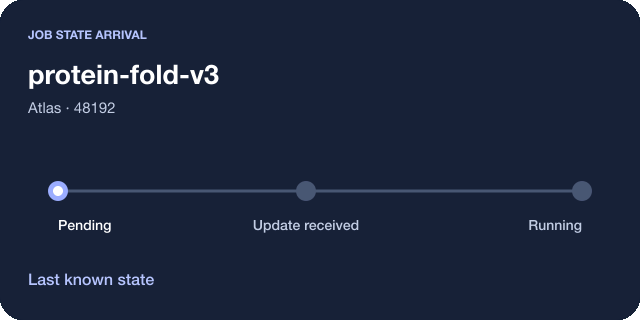

# ssync for iOS

The Swift-native ssync app and its design system. The direction is **Relay**: warm paper, deep ink, cobalt, custom components, and short event-driven animations.

Open [Ssync.xcodeproj](Ssync.xcodeproj) and select the **Ssync** scheme. Requires Xcode 26+ and iOS/iPadOS 26+. There are no external Swift dependencies. See [implementation status and verification](IMPLEMENTATION.md) for the exact scope and remaining work.

## Build and run

From the repository root:

```sh
ios/scripts/dev.sh build
ios/scripts/dev.sh test-core
```

The project is generated from [project.yml](project.yml) using XcodeGen. The generated project and shared scheme are included. Use Xcode’s Run button with an iPhone Simulator, then tap **Explore the demo**, or enter your ssync server URL and API key.

To install the compiled demo or run iOS tests on an already booted simulator:

```sh
xcrun simctl list devices booted
SSYNC_SIMULATOR_ID='<device UUID>' ios/scripts/dev.sh demo
SSYNC_SIMULATOR_ID='<device UUID>' ios/scripts/dev.sh test-ios
```

UI tests operate on demo data. The scripts do not explicitly boot or erase simulators.

For a physical device, create `ios/Configuration/Local.xcconfig` with `DEVELOPMENT_TEAM = YOUR_TEAM_ID`. This ignored file is loaded by the shared signing configuration and survives project regeneration. Keep signing credentials and provisioning profiles out of the repository. Both targets need App Group **group.com.ssync.mobile**. The app needs Push Notifications; Debug uses the development APNs entitlement, Release uses production. Match bundle and APNs environment with your server. The native build has been signed and installed on an iPhone 16 Pro Max running iOS 26.6.2.

Native push delivery needs a signed device build for verification. Widgets use saved snapshots. Live Activities currently update while ssync is foregrounded; remote ActivityKit push remains a server integration task.

Start with the [full design specification](DESIGN_SPEC.md). It covers the brand, sixteen screen concepts, navigation, output workspace, host and partition awareness, watchers, launch, notifications, Live Activities, widgets, architecture, migration, and acceptance criteria.


## Review the design

- [Brand and logo](design/boards/01-brand.png)
- [Signature components](design/boards/02-components.png)
- [Widgets and Live Activities](design/boards/03-system-surfaces.png)
- [Screens](design/boards/04-screen-overview.png)
- [Motion storyboard](design/boards/05-motion.png)
- [Asset inventory](design/ASSET_MANIFEST.md)
- [Validation results](design/VALIDATION.md)

## Key decisions

Four tabs: **Jobs · Hosts · Watchers · Launch**.

The main screens use custom ssync compositions and motion. Native APIs provide navigation, gestures, text behavior, accessibility, notifications, widgets, and Live Activities.

Output has a dedicated reading workspace, follow dock, search, local markers, and bookmarks. Hosts shows partition allocation and job context with clear observation ages.

## Motion studies



- [Watcher event](assets/motion/watcher-event.svg)
- [Launch handoff](assets/motion/launch-handoff.svg)

The studies replay for review. In the app, each animation plays only after a qualifying event; reduced-motion presentation remains complete.

## Assets and rebuilding

Editable vectors live in assets/. Rendered concept boards and screens live in design/. Resources/Assets.xcassets contains flat icon variants, adaptive colors, and custom vector template glyphs.

From the repository root:

~~~
UV_CACHE_DIR=/private/tmp/ssync-uv-cache uv run --no-sync python ios/scripts/generate_design_assets.py
UV_CACHE_DIR=/private/tmp/ssync-uv-cache uv run --no-sync python ios/scripts/validate_design_assets.py
~~~

The design renderer uses rsvg-convert and ImageMagick. It is independent of the native build.

The specification describes the complete intended experience. [IMPLEMENTATION.md](IMPLEMENTATION.md) distinguishes working native flows from unverified integrations and remaining design work.
